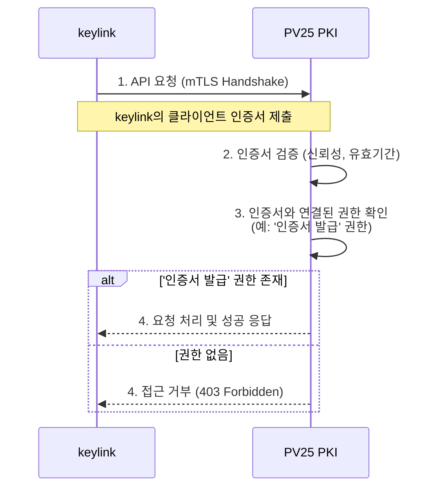

<style>
@import url('https://fonts.googleapis.com/css2?family=Noto+Sans+KR:wght@400;700&display=swap');
@import url('https://fonts.googleapis.com/css2?family=Source+Code+Pro&display=swap');

.code-block-fixed {  
  display: block;  padding: 5px;  overflow: auto; min-height:100px; max-height: 100%;  word-wrap: normal;
}
.reveal .hljs:not(:first-child).fragment { box-sizing: content-box; }
.reveal, .reveal h1, .reveal h2, .reveal h3, .reveal h4, .reveal h5, .reveal h6 {
  font-family: 'Noto Sans KR', sans-serif;
  text-transform: none;
  margin-bottom: 1px;
}
.reveal p {
  margin: 10px;
}
li:last-of-type {
  margin-bottom: 10px;
}
</style>
---
<!-- .slide: template="[[tpl-title]]" -->
::: title
PV25 PKI 아키텍처
:::

::: subtitle
인증서 기반 mTLS 연동 및 권한 관리
:::

::: author
발표자: 홍길동
:::

::: date
📆 2024-07-29
:::

::: footnote
본 문서는 PV25 프로젝트의 핵심 아키텍처, 특히 외부 시스템과의 안전한 연동 방안을 설명합니다.
:::

---
## 무엇을 이야기할까요?

오늘 발표에서는 **'PV25'** 라는 인증 시스템이 어떤 배경에서 시작되었고, 어떤 기술적 문제를 해결하며, 어떻게 동작하는지 누구나 이해하기 쉽게 설명해 드리고자 합니다.

- **1. "왜?"**
  - 이 프로젝트는 왜 시작되었을까요? (배경 및 목표)

- **2. "어떤 문제를 해결해야 할까요?"**
  - 우리가 마주한 핵심 기술 과제

- **3. "그래서, 어떻게 해결할 것인가?"**
  - 핵심 아키텍처와 동작 방식 소개

- **4. "무엇을 만들고 있는가?"**
  - 주요 기능 요구사항 살펴보기
---
## 1. "왜?" - 프로젝트의 배경

`keylink`는 키 관리, 인증서 발급, 서명 등 민감한 정보를 다루는 여러 핵심 컴포넌트로 구성된 시스템입니다.

이 컴포넌트들이 서로 통신할 때, 우리는 두 가지 근본적인 질문에 답해야 합니다.

- **"누가" 요청하는가? (신원 인증, Authentication)**
  - 요청자가 정말로 신뢰할 수 있는 시스템인지 어떻게 증명할 것인가?

- **"무엇을" 할 수 있는가? (권한 인가, Authorization)**
  - 인증된 시스템이더라도, 허용된 작업만 수행하도록 어떻게 강제할 것인가?

> [!quote]
> 기존의 정적 API Key 방식은 키가 탈취되면 모든 권한을 빼앗기는 심각한 약점을 가집니다.

---
## 우리의 목표: 신뢰할 수 있는 보안 아키텍처 구축

오늘 발표의 목표는 명확합니다.

> `keylink`가 필요로 하는 핵심 기능들을 **mTLS**와 **인증서 기반 권한 모델** 위에서 <br> 우리 **PV25 PKI 솔루션**이 어떻게 안전하게 지원하는지 보여드리는 것입니다.

<br>

- **"누가 누구인지 증명하고 (mTLS),**
- **증명된 신원에 부여된 권한 (Certificate)에 따라서만,**
- **특정 작업을 허용한다"**

이것이 우리 아키텍처의 핵심 철학입니다.

---
<!-- .slide: template="[[tpl-2col-1_1]]" -->
## Keylink 요구사항과 PV25 솔루션

`keylink`의 핵심 요구사항은 PV25의 PKI 아키텍처를 통해 더욱 안전하고 효율적으로 해결할 수 있습니다.

::: left
#### Keylink 핵심 요구사항
- **인증서 수명주기 관리**
  - CSR 처리, 인증서 갱신, 폐지 목록(CRL) 배포 등
- **컴포넌트 간 보안 통신**
  - Challenge-Response 기반 양방향 암호화 통신
- **데이터 서명 및 검증**
  - 펌웨어 이미지, SUP 파일 등 중요 데이터의 무결성 보장
- **키 관리 및 감사**
  - 키 생성, 수명주기 관리 및 모든 활동에 대한 로깅
:::

::: right
#### PV25 솔루션 제공 가치
- ✅ **강력한 상호 인증 (mTLS)**
  - 모든 통신 주체의 신원을 암호학적으로 검증하여 'Spoofing' 방지
- ✅ **인증서 기반 접근 제어**
  - 인증서 자체에 권한을 부여하여 API 별 세분화된 접근 통제
- ✅ **중앙화된 인증서 관리**
  - 표준(CMP, OCSP/CRL) 기반의 자동화된 수명주기 관리 지원
- ✅ **높은 보안성 및 감사 추적**
  - HSM 연동을 통한 CA 개인키 보호 및 모든 요청에 대한 감사 로그 제공
:::

---
## 핵심 컨셉: 신원과 권한의 결합

모든 컴포넌트 간 통신은 **mTLS(상호 TLS)**를 통해 '누가 누구인지' 서로 증명합니다. <br> 서버는 클라이언트가 제시한 **인증서(Certificate)**를 보고 '무엇을 할 수 있는지' 판단합니다.

- 더 이상 탈취 위험이 있는 정적 API Key는 필요하지 않습니다.
- 신원과 권한이 암호학적으로 하나로 묶여 관리됩니다.

```mermaid
sequenceDiagram
    participant Client as RA 시스템 (Keylink 컴포넌트)
    participant Server as PV25 CA/API 서버

    Client->>Server: 1. API 요청 (mTLS Handshake 시작)
    Note over Client,Server: 클라이언트 인증서 제출

    Server->>Server: 2. 클라이언트 인증서 신뢰성 검증
    Server->>Server: 3. 인증서에 부여된 권한 확인 (예: '펌웨어 서명' 권한)

    alt '펌웨어 서명' 권한 있음
        Server-->>Client: 4. 요청 처리 및 성공 응답
    else 권한 없음
        Server-->>Client: 4. 403 Forbidden 거절 응답
    end
end
```
---
## 1. 인트로: TDM과 keylink를 위한 신뢰의 기반

TDM 프로젝트는 수많은 제어기와 시스템이 유기적으로 연결되는 복잡한 환경입니다. <br>이 속에서 `keylink`는 다음과 같은 민감한 보안 기능을 전담하는 핵심 허브 역할을 수행합니다.

-   키 생성 및 수명주기 관리
-   인증서 요청(CSR) 처리 및 전달
-   펌웨어 등 중요 데이터 서명 및 검증
-   컴포넌트 간 보안 통신 중계

> [!question]
> 그렇다면, 이 모든 핵심 기능을 수행하는 `keylink` 자체의 신뢰는<br>어디에서 오는가?

---
## PKI의 목표: 신뢰의 원점(Root of Trust) 제공

`keylink`가 자신의 역할을 성공적으로 수행하기 위해서는, 그 기반이 되는 **절대적인 신뢰의 기준점**이 필요합니다.

바로 이 지점에서 우리 **PV25 PKI**가 역할을 합니다.

> [!tip]
> **PV25 PKI의 목표**
> `keylink`가 키 관리, 서명/검증 등을 수행하는 데 필요한 **신뢰의 원점(Root of Trust)과 핵심 서비스를 '안전하고 통제된 방식'으로 제공**하는 것

모든 보안 연산의 시작점이자, 시스템 전체 신뢰의 근간을 마련하는 것이 우리의 핵심 임무입니다.

---
## 솔루션 한 줄 요약

따라서 우리가 만들고 있는 PV25 PKI 솔루션은 다음과 같이 한 문장으로 정의할 수 있습니다.

<br>

> [!quote]
> **"`keylink`를 위한 제로 트러스트 기반의 인증서 발급 및 관리 전문 서비스"**
---
## 2. 솔루션 아키텍처: PKI와 keylink의 협력 모델

mTLS 기반의 안전한 통신과 인증서 기반의 정교한 권한 제어

---
## 전체 연동 아키텍처

`keylink`와 PV25 PKI는 **mTLS**라는 암호화된 터널을 통해 상호 신뢰를 구축하고 통신합니다. 모든 요청과 응답은 이 터널 안에서 안전하게 보호됩니다.

```mermaid
graph LR
    subgraph keylink 시스템
        RA[keylink 컴포넌트<br/>(등록 기관)]
    end

    subgraph "PV25 PKI 솔루션"
        CA_VA[CA / VA 서버]
        HSM[(HSM<br/>Hardware Security Module)]
        CA_VA <--> HSM
    end

    RA -- "모든 API 통신<br/>(mTLS 상호인증)" --> CA_VA
```

-   **`keylink` (RA)**: PV25 PKI에게 인증서 발급/관리 등 핵심 기능을 요청하는 클라이언트
-   **PV25 PKI (CA/VA)**: `keylink`의 신원을 mTLS 인증서로 검증하고, 부여된 권한에 따라 요청을 처리하는 서버
-   **HSM**: CA의 개인키 등 가장 민감한 정보들을 안전하게 보관하는 하드웨어 보안 장치

> [!tip]
> **핵심: 모든 통신은 mTLS**
> `keylink`와 PV25 PKI 간의 모든 API 통신은 **반드시 mTLS로 암호화되고 상호 인증**됩니다. 중간자 공격(MITM)이나 스푸핑(Spoofing)이 원천적으로 불가능합니다.

---
## 인증서 기반 인가(Authorization) 모델

PV25는 "당신이 가진 API Key가 무엇인가?"를 묻지 않습니다. <br> 대신 **"당신은 누구이며, 당신의 신원(인증서)이 무엇을 할 수 있도록 허락하는가?"**를 묻습니다.

> [!quote]
> **Payload가 아닌 신원(Identity)에 기반한 권한 제어**

`keylink`의 모든 API 접근 권한은 **`keylink`에게 발급된 클라이언트 인증서 자체에 의해 결정**됩니다.



---
## 사용자 시나리오 (1/2): `keylink` 시스템 등록

`keylink`가 PV25와 통신하기 위한 '신분증(인증서)'을 발급받는 과정입니다.

-   **1단계: 인증서 생성 (By CA 관리자)**
    -   PV25 관리 콘솔에서 `keylink` 시스템을 위한 mTLS 클라이언트 인증서를 생성합니다.
    -   *(여기에 관리 콘솔에서 인증서 생성하는 스크린샷 추가)*

-   **2단계: 권한 할당 (By CA 관리자)**
    -   생성된 인증서에 `keylink`의 역할에 필요한 API 권한 (예: `CERT_ISSUE`, `CERT_REVOKE`)을 부여합니다.
    -   *(여기에 특정 인증서에 권한을 할당하는 스크린샷 추가)*

-   **3단계: 안전한 전달**
    -   인증서와 개인키를 암호화된 파일(.pfx)로 내보내 `keylink` 시스템 관리자에게 안전한 채널로 전달합니다.
    -   *(여기에 pfx 파일 다운로드 및 전달 과정 관련 이미지 추가)*

---
## 사용자 시나리오 (2/2): `keylink` API 호출 및 인가

`keylink`가 발급받은 '신분증(인증서)'을 사용하여 실제 업무를 처리하는 과정입니다.

-   **4단계: API 호출 (By `keylink`)**
    -   `keylink`는 자신의 인증서를 사용하여 PV25의 '인증서 발급' API를 호출합니다.
    -   *(여기에 keylink 시스템에서 API 호출 로그 또는 코드 스니펫 추가)*

-   **5단계: 신원 및 권한 검증 (By PV25)**
    -   PV25는 mTLS 핸드셰이크 과정에서 `keylink`의 인증서를 받고, 유효성과 권한을 자동으로 검증합니다.
    -   *(여기에 PV25 서버에서 인가 성공/실패 로그 스크린샷 추가)*

-   **6단계: 요청 처리**
    -   `keylink`의 인증서에 '인증서 발급' 권한이 있음을 확인한 PV25는 요청을 정상적으로 처리하고 결과를 반환합니다.
    -   *(여기에 API 호출 성공 후 결과 화면 스크린샷 추가)*
---
## 3. 핵심 연동 시나리오 중심의 라이브 데모

지금부터 세 가지 핵심 시나리오를 통해, PV25 PKI와 `keylink`가 실제로 어떻게 상호작용하는지 라이브 데모로 보여드리겠습니다.

-   **시나리오 0:** `keylink` 시스템의 **안전한 등록**
-   **시나리오 1:** mTLS 기반 **인증서 발급 요청** 및 권한 검증
-   **시나리오 2:** **펌웨어 서명 검증**을 위한 OCSP 상태 조회

---
## 시나리오 0: `keylink` 시스템의 안전한 등록 (Provisioning)

> **상황:** 새로운 `keylink` 시스템을 우리 PKI에 등록하고, 통신을 시작할 수 있는 '신분증'을 발급해야 합니다.

-   **프로세스:**
    1.  CA 관리자가 PKI 관리 UI에서 `keylink`를 위한 클라이언트 인증서를 생성합니다.
    2.  이때, **`keylink`의 역할에 맞는 최소한의 권한**만 인증서에 할당합니다. (예: `ISSUE_CERT`, `RENEW_SELF`)
    3.  암호화된 PFX(.p12) 파일로 내보내 **안전한 채널(Out-of-Band)로 `keylink` 관리자에게 전달**합니다.

> [!tip]
> **데모 시연 포인트**
> PKI 관리자 화면에서 RA용 인증서를 생성하고, '권한' 목록에서 필요한 항목만 선택하여 부여하는 모습을 시연합니다.

---
<!-- .slide: template="[[tpl-2col-1_1]]" -->
## 시나리오 1: mTLS 기반 인증서 발급 요청

> **상황:** `keylink`가 디바이스의 CSR을 받아 CA에 인증서 발급을 요청합니다.

::: left
#### 프로세스
1.  `keylink`는 **자신의 클라이언트 인증서(PFX)를 사용**하여 PKI API 서버와 mTLS 세션을 수립합니다.
2.  PKI는 `keylink`가 제시한 인증서를 검증하고, **`ISSUE_CERT` 권한이 있는지 확인**합니다.
3.  권한이 충분하면 CSR을 처리하여 인증서를 발급 후 반환합니다.
4.  권한이 부족하면 `403 Forbidden` 오류를 반환합니다.

:::

::: right
#### 데모: `curl`을 이용한 API 호출

-   **권한이 있는 경우 (성공)**
```bash
# keylink의 인증서로 인증서 발급 API 호출
$ curl --cert keylink.p12:password \
       --cacert ca.pem \
       -X POST https://pki.api/v1/issue \
       -d @device.csr

# HTTP/1.1 200 OK
# { "certificate": "...", "chain": "..." }
```
-   **권한이 없는 경우 (실패)**
```bash
# 동일한 인증서로 권한이 없는 '폐지' API 호출
$ curl --cert keylink.p12:password \
       --cacert ca.pem \
       -X POST https://pki.api/v1/revoke \
       -d '{"serial": "..."}'

# HTTP/1.1 403 Forbidden
# { "error": "Permission denied" }
```
:::

---
## 시나리오 2: 펌웨어 서명 검증 지원 (OCSP)

> **상황:** `keylink`가 디바이스에 설치될 펌웨어의 서명을 검증하기 위해, 서명에 사용된 인증서가 유효한지 실시간으로 확인해야 합니다.

-   **프로세스:**
    -   PV25 PKI는 `keylink`가 조회할 수 있도록 CRL 배포 엔드포인트(CDP)와 **실시간 OCSP(Online Certificate Status Protocol) 엔드포인트**를 제공합니다.
    -   `keylink`는 이 OCSP 엔드포인트에 인증서의 상태를 질의합니다.

> [!tip]
> **데모: `openssl`을 이용한 OCSP 상태 조회**
> `openssl` 명령어로 OCSP 엔드포인트에 펌웨어 서명 인증서의 상태 조회를 요청하고, `good` 응답을 확인하는 과정을 시연합니다.

```bash
# 펌웨어 서명 인증서(fw_signer.pem)의 상태를 OCSP 서버에 질의
$ openssl ocsp -issuer ca_chain.pem \
               -cert fw_signer.pem \
               -url http://pki.ocsp.example.com

# 응답 결과
fw_signer.pem: good
    This Update: Jul 29 08:00:00 2024 GMT
    Next Update: Aug 05 08:00:00 2024 GMT
```
---
## 4. TDM & keylink 통합 가이드

지금까지의 아키텍처와 데모를 바탕으로, `keylink` 개발팀이 실제 통합 작업을 수행하는 데 필요한 핵심 정보를 안내해 드립니다.

-   **`keylink`의 기능**이 우리 **PKI의 어떤 서비스**와 연결되는가?
-   실제 API 연동은 **어떤 코드**로 시작할 수 있는가?

---
## keylink 개발 항목과 PKI 서비스 매핑

`keylink`의 핵심 요구사항은 아래와 같이 PV25 PKI가 제공하는 표준 API 및 엔드포인트와 직접 매핑됩니다.

| keylink 개발 항목 | PKI 제공 서비스 | 연동 방식 |
| :--- | :--- | :--- |
| **CSR 처리 및 전달** <br> (`[RA - B.E] CSR Routing`) | 인증서 발급 API | mTLS 기반 REST API |
| **인증서 갱신 요청** <br> (`[RA - B.E] ...갱신 요청 Relay`) | 인증서 갱신 API <br> (`RENEW_SELF`) | mTLS 기반 REST API |
| **인증서 수명주기 관리** <br> (`[인증서 - B.E] LifeCycle 관리`) | 인증서 폐지/조회 API | mTLS 기반 REST API |
| **CRL 배포** <br> (`[인증서 - B.E] CRL 배포`) | CRL 배포 엔드포인트(CDP) | HTTP GET |
| **서명 검증 (유효성 확인)** <br> (`[서명/검증 - B.E] 서명 검증`) | OCSP 상태 조회 엔드포인트 | HTTP POST |

---
<!-- .slide: class="code-block-fixed" -->
### PKI 솔루션 간이 연동 가이드 (mTLS Quick Start)

> [!info]
> 모든 API 요청은 Bearer Token이 아닌, **mTLS 클라이언트 인증서**를 통해 인증 및 인가됩니다.

**사전 준비:**
-   PKI 서버 Base URL: `https://pki.example.com`
-   PKI 관리자로부터 전달받은 클라이언트 인증서 파일: `keylink_identity.p12`
-   인증서 파일 암호: `p12_password`

**Step 1. 연동 테스트 (mTLS Health Check)**
-   전달받은 인증서로 mTLS 통신이 정상적으로 수립되는지 확인합니다.
```bash
curl --cert-type P12 --cert keylink_identity.p12:p12_password \
     https://pki.example.com/health
```
-   **예상 응답:** `{"status": "UP"}`

**Step 2. 인증서 발급 요청 (mTLS 기반)**
-   `--cert` 옵션을 포함하여 API를 호출하면, PKI가 인증서를 분석해 권한을 확인합니다.
```bash
curl -X POST \
     --cert-type P12 --cert keylink_identity.p12:p12_password \
     -H "Content-Type: application/json" \
     -d '{
           "csr": "-----BEGIN CERTIFICATE REQUEST-----\n...",
           "profile": "TDM_DEVICE_LEVEL_1"
         }' \
     https://pki.example.com/api/v1/certificates
```
-   **예상 응답:** `keylink_identity.p12`에 `ISSUE_CERT` 권한이 있는 경우, 발급된 인증서(PEM) 반환. 그렇지 않으면 `403 Forbidden`.

**Step 3. 내 인증서 갱신 (RENEW_SELF)**
-   만료가 임박한 `keylink` 자신의 인증서를 스스로 갱신합니다.
```bash
curl -X POST \
     --cert-type P12 --cert keylink_identity.p12:p12_password \
     https://pki.example.com/api/v1/certificates/renew-self
```
-   **예상 응답:** `keylink_identity.p12`에 `RENEW_SELF` 권한이 있는 경우, 갱신 발급된 인증서(PEM) 반환.
---
## 5. 결론 및 협력 방안

> [!quote]
> PV25는 단순 기능 제공을 넘어, **제로 트러스트 원칙에 입각한 안전한 연동 모델**을 통해 <br> `keylink`와 TDM 생태계 전체의 보안 수준을 격상시키는 것을 목표로 합니다.

<br>

-   **핵심 가치 제공**
    -   정적 API Key를 제거하고, mTLS 인증서 기반의 강력한 상호 인증 및 인가 모델을 제공
    -   모든 통신 주체의 신원을 암호학적으로 증명하고, 신원에 부여된 최소 권한만 허용

-   **향후 협력 방안**
    -   `keylink` 시스템 연동을 위한 **mTLS 클라이언트 인증서**의 신속한 발급 지원
    -   API 연동 가이드 및 샘플 코드를 포함한 **지속적인 기술 지원** 약속

---
## 6. Q & A

궁금하신 점이 있으시면 편하게 질문해 주십시오.

---
<!-- .slide: template="[[tpl-title]]" -->
::: title
감사합니다
:::