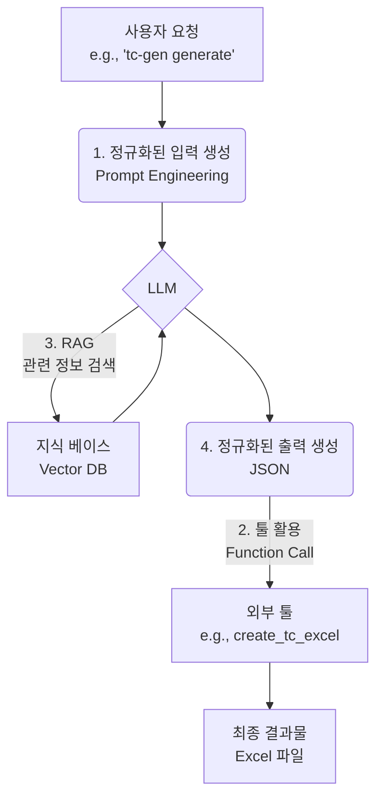
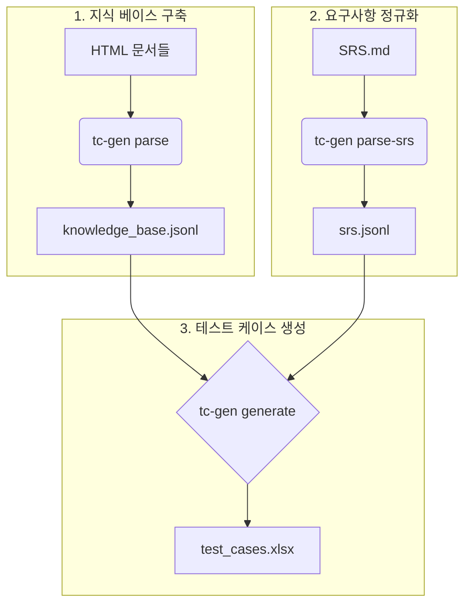

<style>
@import url('https://fonts.googleapis.com/css2?family=Noto+Sans+KR:wght@400;700&display=swap');
@import url('https://fonts.googleapis.com/css2?family=Source+Code+Pro&display=swap');

.code-block-fixed {  
  display: block;  padding: 5px;  overflow: auto; min-height:100px; max-height: 100%;  word-wrap: normal;
}
.reveal .hljs:not(:first-child).fragment { box-sizing: content-box; }
.reveal, .reveal h1, .reveal h2, .reveal h3, .reveal h4, .reveal h5, .reveal h6 {
  font-family: 'Noto Sans KR', sans-serif;
  text-transform: none;
  margin-bottom: 1px;
}
.reveal p {
  margin: 10px;
}
li:last-of-type {
  margin-bottom: 10px;
}
</style>
---
## AI Agent 개발
개요

---
## AI의 단기적 방향성
- **Apps SDK** (ChatGPT와 직접적으로 외부 앱 연동)
  - 비개발자용
- **Building Agents** (Agent Kit)
  - GUI로 에이전트를 쉽게 만드는 기능
  - 비/반(No/Half)개발자용 (Power Automate 수준의 난이도)
- **Coding Agent** (Codex 등)
  - 개발자용 코딩 도우미

::: footnote
참고: https://www.youtube.com/watch?v=aoYy5JeS6fA
:::

---
## 오늘의 주제 - Building Agents
- **Apps SDK**: AI와 외부 앱을 연동하는 목적으로, 직접 개발할 일은 많지 않을 것으로 예상
- **Coding Agent**: 코딩 도우미로, 이미 모두가 사용하고 있을 것으로 예상
- **Building Agents**: 따라서 오늘은 GUI 기반으로 직접 AI 에이전트를 만드는 기술인 Building Agents에 대해 논의함
---
<!-- .slide: template="[[tpl-title]]" -->
::: title
Part 2
Core Concepts and Example
:::

---
## AI Agent의 핵심 요소
AI Agent는 일반적으로 다음 네 가지 핵심 요소를 중심으로 구성됨

- <span class="fragment">정규화된 입력 (Structured Input)</span>
- <span class="fragment">툴 활용 (Tool Use)</span>
- <span class="fragment">RAG (Retrieval-Augmented Generation)</span>
- <span class="fragment">정규화된 출력 (Structured Output)</span>

<div class="fragment">

> [!quote]
> 결국 Agent는 **정해진 형식으로** 생각하고, **정해진 도구를** 사용하며, **정해진 형식으로** 대답하는 프로그램

</div>

---
## AI Agent 동작 흐름
`tc-gen` 예시를 바탕으로 한 핵심 요소의 동작 흐름



---
## 구체적인 예시: `tc-gen`
핵심 요소들이 실제로 어떻게 적용되는지 `tc-gen` (테스트 케이스 자동 생성기) 예제를 통해 살펴보겠음

- **입력**: SRS 문서 (Markdown), 기술 문서 (HTML)
- **지식**: 기술 문서를 파싱한 `knowledge_base.jsonl`
- **동작**: LLM을 호출하여 각 SRS 요구사항에 대한 테스트 케이스 생성
- **출력**: 테스트 케이스 (Excel)

::: footnote
참고: `tc-gen`은 실제 프로젝트에서 사용된 도구임
:::

---
## 1. 정규화된 입력 (Structured Input)
- LLM에게 일관되고 명확한 작업을 지시하기 위해 **사전에 정의된 형식(Template)의 Prompt**를 사용하는 것
- 변수(e.g., 요구사항 ID, 검색된 문서)를 Template에 동적으로 삽입하여 사용함

<div class="code-block-fixed">

```python
# tc_gen/main.py - generate() 함수
user_prompt = f"""
다음 SRS 요구사항에 대해 테스트 케이스를 생성해주세요.

--- 현재 SRS 요구사항 ---
ID: {srs_item.get('ID')}
상세 설명: {query_text}

--- 추가 참고 자료 (Knowledge Base) ---
{context_str if context_str else "제공된 참고 자료 없음."}

--- 테스트 케이스 생성 지시 ---
... Positive 시나리오 1개와 Negative 시나리오 1개를...
다음 JSON 형식에 맞춰 출력해야 합니다:

```json
[
  {{
    "srs_id": "{srs_item.get('ID')}",
    "title": "{{테스트 케이스 제목}}",
    ...
  }}
]
```
"""
```
</div>

---
## 2. 툴 활용 (Tool Use / Function Calling)
- LLM이 직접 수행할 수 없는 작업을 외부 함수나 API를 호출하여 처리하는 기능
- 예: 파일 시스템 접근, 데이터베이스 조회, 외부 서비스 연동
- LLM은 "어떤 툴을, 어떤 인자(argument)로 호출할지"를 결정하고, 실제 실행은 애플리케이션 코드가 담당함

<div class="code-block-fixed">

```python
# tc_gen/main.py - generate() 함수

# 1. LLM이 JSON 형식의 TC 데이터를 생성 (정규화된 출력)
full_response_content = _call_llm_with_fallback(...)
generated_tcs = json.loads(json_str)

...

# 2. 생성된 데이터를 'create_tc_excel'이라는 툴(함수)에 전달
create_tc_excel(list(final_tcs_to_write.values()), output)
```
</div>

---
## 3. RAG (Retrieval-Augmented Generation)
- LLM의 환각(Hallucination)을 줄이고, 최신/내부 정보를 기반으로 답변하게 만드는 기술
- 사용자의 질문과 관련된 문서를 외부 지식 베이스(e.g., Vector DB)에서 검색하여 Prompt에 함께 포함시킴

<div class="code-block-fixed">

```python
# tc_gen/main.py - generate() 함수
context_str = ""
if use_rag and vs is not None:
    # 1. Vector DB에서 현재 요구사항과 관련된 문서 검색
    retrieved_context = vs.retrieve(query_text, top_k=5)
    context_str = "\n".join([item.document for item in retrieved_context])

# 2. 검색된 내용을 Prompt에 포함하여 LLM에 전달
user_prompt = f"""
...
--- 추가 참고 자료 (Knowledge Base) ---
{context_str if context_str else "제공된 참고 자료 없음."}
...
"""
```
</div>

---
## 4. 정규화된 출력 (Structured Output)
- LLM의 응답을 단순 텍스트가 아닌 **JSON, XML 등 기계가 파싱할 수 있는 형식**으로 받도록 강제하는 것
- 이를 통해 LLM의 출력을 후속 로직(e.g., 툴 호출, DB 저장)에 안정적으로 연동할 수 있음

<div class="code-block-fixed">

```json
// Prompt에서 LLM에게 요청한 출력 JSON 구조의 예시
[
  {
    "srs_id": "PV25-FR-06",
    "title": "정상적인 인증서 발급 요청 처리",
    "preconditions": [
      "사용자가 R.RA 시스템에 로그인되어 있다."
    ],
    "test_steps": [
      {
        "step": 1,
        "action": "인증서 발급 메뉴로 이동하여 필수 정보를 입력하고 '발급' 버튼을 클릭한다.",
        "test_data": "유효한 CSR, 인증서 프로필",
        "expected_result": "시스템이 CA에 인증서 발급을 요청하고 성공적으로 인증서를 수신한다."
      }
    ],
    "notes": ""
  }
]
```
</div>
---
<!-- .slide: template="[[tpl-title]]" -->
::: title
Part 3
Explanation with Sample Project
:::

---
## 예시: Test Case Generator (`tc-gen`)
`tc-gen`은 AI Agent의 핵심 요소들이 어떻게 실제 프로젝트에 적용되는지 보여주는 좋은 예시

- **목표**: 소프트웨어 요구사항 명세서(SRS)와 기술 문서를 기반으로 테스트 케이스(TC)를 Excel 형식으로 자동 생성
- **기대 효과**: QA 엔지니어의 반복적인 TC 작성 업무를 자동화하여 생산성 향상
- **기반 기술**: LLM (Google Gemini), RAG, Function Calling (Tool Use)

::: footnote
`tc-gen`은 실제 프로젝트에서 영감을 받아 재구성한 도구임
:::

---
## `tc-gen` 전체 작업 흐름
`tc-gen`은 3단계의 명확한 CLI 명령어를 통해 결과물을 생성함



<div class="fragment">

> [!note]
> 각 단계는 AI Agent의 핵심 요소를 구현하는 과정과 밀접하게 연관됨

</div>

---
## Step 1: 지식 베이스 구축 (`parse`)
RAG를 위한 사전 준비 단계로, Confluence 등에서 Export한 HTML 기술 문서들을 LLM이 이해하기 쉬운 형식으로 가공함

- **입력**: HTML 문서들이 포함된 디렉토리
- **동작**:
  - `BeautifulSoup` 라이브러리를 사용하여 HTML에서 텍스트와 테이블 데이터를 추출 (`document_parser.py`)
  - 의미 있는 단위(chunk)로 분할하여 JSONL 파일로 저장
- **출력**: `knowledge_base.jsonl`
- **핵심 요소**: RAG의 **Retrieval** 대상이 되는 지식 소스를 생성하는 과정

```bash
# Confluence에서 Export한 HTML 문서가 있는 디렉토리를 입력
python -m tc_gen.main parse <HTML_문서_디렉토리_경로>
```

---
## Step 2: 요구사항 정규화 (`parse-srs`)
사람이 작성한 SRS 문서를 LLM을 이용해 기계가 처리하기 용이한 정규화된 형식으로 변환

- **입력**: 자유 형식의 SRS 마크다운 파일 (`SRS.md`)
- **동작**:
  - LLM에게 "주어진 마크다운에서 요구사항 ID, 상세 설명, 유형을 추출하여 JSONL 형식으로 만들어줘" 라고 요청
  - LLM의 응답을 파싱하여 파일로 저장
- **출력**: `srs.jsonl`
- **핵심 요소**: **정규화된 입력 (Structured Input)**을 생성하는 단계

```bash
# 사람이 작성한 SRS 마크다운 파일을 입력
python -m tc_gen.main parse-srs <SRS_마크다운_파일_경로>
```

---
## Step 3: 테스트 케이스 생성 (`generate`)
`tc-gen`의 핵심 기능으로, 준비된 데이터(지식, 요구사항)를 바탕으로 Agent가 TC를 생성하고 툴을 사용해 결과물을 저장함

- **입력**: `srs.jsonl`, `knowledge_base.jsonl`
- **동작**: `srs.jsonl`의 각 요구사항에 대해 다음을 반복
  1. 요구사항과 관련된 내용을 `knowledge_base`에서 검색 (RAG)
  2. 검색된 내용과 요구사항을 Prompt Template에 삽입 (Structured Input)
  3. LLM 호출 및 JSON 형식의 TC 데이터 수신 (Structured Output)
  4. 수신한 데이터를 `create_tc_excel` 함수에 전달 (Tool Use)
- **출력**: `test_cases.xlsx`

```bash
# 1, 2단계에서 생성된 파일들을 입력으로 사용
python -m tc_gen.main generate tc_gen/output/srs.jsonl tc_gen/output/knowledge_base.jsonl
```

---
## `generate` 명령어 상세 동작 흐름
`tc-gen generate` 명령어는 AI Agent의 네 가지 핵심 요소를 모두 사용함

```mermaid
graph TD
    A[srs.jsonl의<br>각 요구사항] --> B{1. RAG<br>Vector DB에서 관련 지식 검색};
    B --> C(knowledge_base.jsonl);
    C --> B;
    
    B --> D(2. 정규화된 입력 생성<br>Prompt Template);
    D --> E{LLM};
    
    E --> F(3. 정규화된 출력 생성<br>TC 데이터 (JSON));
    F --> G(4. 툴 활용<br>create_tc_excel 함수 호출);
    G --> H[test_cases.xlsx<br>Excel 파일 저장/업데이트];
```

---
## 최종 결과물: Excel 테스트 케이스
LLM이 생성한 정규화된 출력(JSON)을 `create_tc_excel` 툴이 사람이 보기 좋은 형태의 Excel 파일로 변환

| Category | Details |
| :--- | :--- |
| **SRS ID** | PV25-FR-06 |
| **Title** | 정상적인 인증서 발급 요청 처리 |
| **Pre-conditions** | 사용자가 R.RA 시스템에 로그인되어 있다. <br> 유효한 인증서 프로파일이 시스템에 등록되어 있다. |
| **Notes** | |

<br>

| No. | Action | Test Data | Expected Result |
| :--- | :--- | :--- | :--- |
| **1** | 인증서 발급 메뉴로 이동하여 필수 정보를 입력하고 '발급' 버튼을 클릭한다. | 유효한 CSR, 인증서 프로필 | 시스템이 CA에 인증서 발급을 요청하고 성공적으로 인증서를 수신한다. |
| **2** | 발급된 인증서 정보를 확인한다. | - | 인증서의 Subject, 유효기간 등 정보가 요청한 내용과 일치한다. |

---
## 추가 기능: 대화형 수정 (`update`)
생성된 테스트 케이스를 LLM과 대화하며 수정하는 기능으로, "Human-in-the-loop" 워크플로우를 구현

- **동작**:
  1. 사용자가 Excel 파일과 수정할 TC의 ID를 지정
  2. "사전 조건을 더 상세하게 만들어줘" 와 같이 자연어로 수정 사항을 지시
  3. LLM이 수정된 TC (JSON)를 제안
  4. 사용자가 제안을 확인하고 적용 여부를 결정
- **의의**: Agent가 생성한 결과물을 사용자의 피드백을 통해 반복적으로 개선하는 고도화된 상호작용 방식

```bash
python -m tc_gen.main update <엑셀_파일_경로.xlsx> <TC_ID>
```

---
## `tc-gen` 예시 요약
`tc-gen` 프로젝트는 AI Agent의 네 가지 핵심 요소를 유기적으로 결합하여 실제 문제를 해결하는 과정을 보여줌

- **정규화된 입력 (Structured Input)**
  - `parse-srs`를 통해 `SRS.md`를 `srs.jsonl`로 변환
  - `generate` 내부에서 정해진 Prompt Template 사용
- **툴 활용 (Tool Use)**
  - LLM이 생성한 JSON 데이터를 `create_tc_excel` 함수에 전달하여 Excel 파일 생성
- **RAG (Retrieval-Augmented Generation)**
  - `parse`로 구축한 `knowledge_base.jsonl`을 Vector DB에 저장
  - 요구사항과 관련된 기술 문서를 검색하여 Prompt에 추가
- **정규화된 출력 (Structured Output)**
  - LLM에게 테스트 케이스를 항상 정해진 JSON 형식으로 반환하도록 강제
---
<!-- .slide: template="[[tpl-title]]" -->
::: title
Part 4
Ailoy
:::

---
## 부록: Ailoy 라이브러리 소개
`tc-gen` 프로젝트 개발의 기반이 된 `Ailoy`는 AI Agent 애플리케이션 구축을 간소화하기 위한 Python 라이브러리

- **목적**: LLM 상호작용, RAG, 툴 사용 등 AI Agent의 핵심 기능을 추상화하여 개발자가 비즈니스 로직에 집중할 수 있도록 지원
- **주요 특징**:
  - `Agent`, `VectorStore` 등 직관적인 컴포넌트 기반 아키텍처
  - LLM 모델 및 Vector DB 백엔드(e.g., `faiss`)를 쉽게 설정하고 교체 가능
  - 필수 기능에 초점을 맞춘 경량화된 구조

> [!note]
> `tc-gen`은 `Ailoy`를 사용하여 LLM 호출, RAG를 위한 지식 베이스 구축 및 검색 등 핵심 AI 기능을 구현함

---
## Ailoy의 주요 구성 요소
`tc-gen`에서는 `Ailoy`의 네 가지 핵심 클래스를 사용하여 Agent의 동작을 구현함

| 클래스 | 역할 | `tc-gen` 사용 예시 |
| :--- | :--- | :--- |
| **`Runtime`** | Ailoy 컴포넌트들의 실행 환경을 관리하는 백그라운드 프로세스 | `rt = Runtime()`로 시작, `rt.stop()`으로 종료 |
| **`APIModel`** | 사용할 LLM 모델(ID)과 인증(API Key) 정보를 정의하는 설정 객체 | `APIModel(id="gemini-2.5-pro", api_key=...)` |
| **`Agent`** | LLM과의 실제 상호작용을 담당. `System Message`를 설정하고 `query`로 질의 | `agent = Agent(rt, model, system_message)`<br>`agent.query(prompt)` |
| **`VectorStore`** | RAG를 위한 벡터 데이터베이스. 임베딩, 데이터 삽입 및 검색 기능 제공 | `VectorStore(rt, "BAAI/bge-m3", "faiss")`<br>`vs.retrieve(query_text)` |

<div class="code-block-fixed">

```python
# tc_gen/main.py - generate() 함수 중
# 1. Runtime 및 VectorStore 초기화
rt = Runtime()
with VectorStore(rt, "BAAI/bge-m3", "faiss") as vs:
    # 지식 베이스를 VectorStore에 삽입 (생략)
    ...
    # 2. 각 SRS 요구사항에 대해 RAG 수행
    retrieved_context = vs.retrieve(query_text, top_k=5)

    # 3. 모델 및 Agent 설정
    api_key = os.environ.get("GEMINI_API_KEY")
    model = APIModel(id="gemini-2.5-pro", api_key=api_key)
    agent = Agent(rt, model, system_message=final_system_message)

    # 4. LLM에 질의 (Prompt)
    response = agent.query(user_prompt)
...
# 5. Runtime 종료
rt.stop()
```
</div>