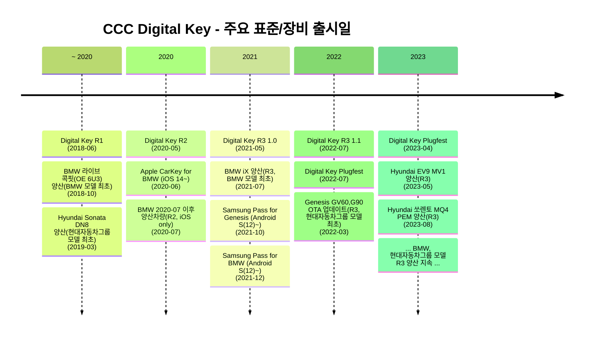

<!-- .slide: template="[[tpl-title]]" -->
::: title
CCC Digital Key 시장 조사<!-- element style="color: black" -->
:::

::: author
V2X연구소 이진우
:::

::: date
📆 2023-09-07
:::

---
## 히스토리
![[ccc dk - history.png]]

<!--

-->

::: footnotes
- 2020년 R2 표준 이전 양산 모델에 탑재된 디지털키는 CCC 표준을 따르지 않음
:::

---
## 주요 업체 
### 스마트폰

| 업체 | 지원 장비                 |
| ---- | ------------------------- |
| 애플 | BMW, 현대자동차그룹       |
| 구글 | BMW, 현대자동차그룹       |
| 삼성 | BMW, 현대자동차그룹, 직방 |

### 비포마켓
- BMW:
	- Vehicle OEM Server: 컨티넨탈
	- Vehicle: 컨티넨탈
- 현대자동차그룹:
	- Vehicle OEM Server: 현대오토에버
	- Vehicle: 현대모비스 - 아모센스
- 직방: 
	- Vehicle(도어락) OEM Server: 직방
	- Vehicle(도어락): 솔리티, 메타네트웍스

---

## 주요 업체 - BMW Set

![[ccc dk - continental.png|300]]
*Continental: Vehicle OEM Server*

![[ccc dk - continental - device.png|300]]
*Continental: transceiver modules for the BMW iX electric vehicle*

---

## 주요 업체 - 현대자동차그룹 Set
### Vehicle OEM Server: 오토에버

![[ccc dk - autoever - backend.png|600]]

주요 특징:
- 가입자 약 백만명
- IDC 이중화:
	- IDC1: 의왕
	- IDC2: 상암

---

### Vehicle Module: 현대모비스 - 아모센스 (1/6)
![[ccc dk - amosense.png|700]]
*우하단: 시기상 GV60에 대한 언급으로 추정*

---
### Vehicle Module: 현대모비스 - 아모센스 (2/6)

![[ccc dk - amosense - mobis.png|350]]
*아모센스가 모비스에 납품한 CCC DK R3 규격 BLE 모듈*

---

### Vehicle Module: 현대모비스 - 아모센스 (3/6)

![[ccc dk - amosense - master.png|200]]

![[ccc dk - amosense - master 2.png|200]]

- 헤드라이너 장착용 아모센스 메인 모듈(UNIT ASSY-UWB&BLE; MASTER) [스펙](https://device.report/amosense/asunbm):
	- NXP UWB 칩 사용 모듈
	- Digital Key 2.0 (BLE+UWB)  
		- Remote Keyless Entry(BLE)  
		- Passive Keyless Entry(UWB)  
		- 시동 인증(UWB)  
		- Digital Key 공유  
		- 차량상태공유

---

### Vehicle Module: 현대모비스 - 아모센스 (4/6)

![[ccc dk - amosense - master 3.png]]

---

### Vehicle Module: 현대모비스 - 아모센스 (5/6)
#### 기타사항(1/2)

> [!quote]
> 회사관계자는 더스탁에 “자동차 전장용 UWB통신의 주요 경쟁사는 독일의 BOSCH와 Marquardt가 있으나 아직 시장에 본격적으로 상용화된 제품은 없다”면서 “당사가 디지털 키의 선두 주자로 지난해부터 상용화를 진행하고 있다”고 밝혔다.  
> [주간 IPO](https://www.the-stock.kr/news/articleView.html?idxno=14494)

- Marquardt는 AutoCrypt에 CCC 개발을 요청한 적이 있음(2022-07)

---
### Vehicle Module: 현대모비스 - 아모센스 (6/6)
#### 기타사항(2/2)
- Marquardt 주요 요구사항:
	- 조직은 ==전 세계 차량 OEM==에 대한 솔루션 지원을 보장해야 합니다
	- ==전 세계에서 작동 가능==해야 합니다
	- 차량 OEM 백엔드 애플리케이션의 운영은 ==99,99%의 가용성==을 보장해야 하며, 이는 IT 인프라도 이에 따라 설정되어야 함을 의미합니다
	- ==최소한 ISO 27001 표준에 따라 구현==되어야 합니다
	- ==SBOD 내용 없음==
- ==요구사항에 대응하려면 최소한 오토에버 Vehicle OEM Server 수준으로는 구현되어야 함==

 
- Marquardt의 경우 UWB/BLE 모듈 대응은 가능하나, Vehicle OEM Server 대응이 어려운 것으로 추측됨

---
### Vehicle Module: 오토에버 (1/6)
- 오토에버에서 ==HSM 기반 디지털키 솔루션 개발== 선행과제를 2022년 말부터 진행중

 
- 의문점:
	- GV60, G90등에 이미 아모센스 CCC DK R3가 탑재되어 있는데 중복진행
		- ==아모센스 모듈에 HSM적용이 되어 있지 않나?==
		- ==자사에서 현대자동차 CCC 3.0 프로젝트를 수주함==. 범위 확인 필요
			- Vehicle OEM Server일 가능성은 없어 보임 (오토에버 제품의 수준이 높음)
			- Vehicle파트라면 아모센스 제품에 HSM적용이 되어있지 않아 그 부분의 개발이 필요한 것인지?
				- HSM 적용 없이 양산했었다는 뜻인가?

---

### Vehicle Module: 오토에버 (2/6)

![[ccc dk - autoever - doorlock.png]]
*Autoever: Doorlock prototype*

---
### Vehicle Module: 오토에버 (3/6)

![[ccc dk - autoever - doorlock architecture.png]]
*Autoever: Doorlock prototype architecture*

::: footnotes
프로토타입에도 HSM을 고려함
:::

---
### Vehicle Module: 오토에버 (4/6)

![[ccc dk - autoever - doorlock mockup.png]]
*Autoever: Doorlock prototype mockup*

---
### Vehicle Module: 오토에버 (5/6)

![[ccc dk - autoever - haed.png]]
*Autoever: HAE DKey*

---
### Vehicle Module: 오토에버 (6/6)

![[ccc dk - autoever - haed architecture.png]]
*Autoever: HAE DKey Architecture*

::: footnotes
2022-11 HMG 개발자 컨퍼런스 자료에 따르면, ==현대오토에버측 HAE DKey 장비의 개발은 현재진행형으로 보임==.
:::

---

## 애프터마켓 (유사 DK)
![[ccc dk - aftermarket.png]]

::: footnotes
- CCC DK 규격 제품 없음
- 브링앤티는 현대모비스에서 개발함
:::

---
## 관련 인력 조사
### 현대자동차그룹
![[ccc dk - autoever - recruit.png]]

- 전익진 책임연구원
	- 현대오토에버 차량전장선행개발1팀
	- 차량보안모듈 
- [강희석 팀장](https://www.linkedin.com/in/%ED%9D%AC%EC%84%9D-%EA%B0%95-3b5519110/?originalSubdomain=kr)
	- 현대오토에버 DKC서비스셀 셀장
	- 디지털키(현대, 기아, 제네시스) 시스템 구축/관리

---

## 관련 인력 조사
### 해외
- [Jagadeesh Gowda](https://www.linkedin.com/in/jagadeesh-gowda-26529b10/) - ==Bosch== → ==Volvo== Senior Design Engineer
	- My journey has enriched me with significant expertise in the Car Connectivity Consortium (CCC) Digital Key and Ultra-Wideband (UWB) systems
	- Non-Functional/Functional Requirements Analysis:Defining and analyzing NFR for CCC Digital Key and UWB systems
- [Mohamed Hagag Shahat](https://linkedin.com/in/muhamedhagag/) - ==eJad== Senior Embedded Software Engineer
	- AUTOSAR-Cybersecurity-Digital Key CCC
	- Currently am working as automotive software engineer in ==2023-01 VOLVO project==(Phone as Key) digital key, CCC stander for pairing the Car with iPhone using digital key release and NXP Secure element core.Contractor with Denso America - VOLVO Cars
	- Working on owner pairing between IPhone and Vehicle using digital key release 3 and NXP applet SE

---

## Product-market fit questions (1/3)

### Desirable to customer
- 기존 OEM들이 자체제작한 디지털 키는 NFC방식이라 스마트 키 대비 사용감이 좋지 않았음. UWB기술을 활용하려면 기존 시스템을 교체할 필요성이 있는데, 이 때 CCC DK R3 도입을 고려하게 될 것으로 예상됨.
	- 디바이스 측은 CCC DK 표준이 주도권을 가지고 있다고 볼 수 있음. 차량 업체가 CCC DK를 도입할 강한 이유가 될 듯
- 현대자동차그룹과 BMW를 제외한 대다수의 OEM이 CCC DK R3 미보유. 구매 수요는 존재할 것으로 예상됨
	- 단, ==현대자동차그룹, BMW의 수요는 사실상 없을 것== 으로 추정
- 직방 도어락의 사례와 같이, 비단 차량이 아니어도 수요가 존재할 것으로 예상됨

---

## Product-market fit questions (2/3)

### Viable in parketplace
- Vehicle OEM Server의 경우 컨티넨탈과 오토에버, 직방 등 규모가 있는 기업과 경쟁해야 함
	- 단, OEM별로 수요가 발생할 것으로 예상되므로 판매 가능성은 있을 것으로 예상
	- 혹은 IoT 업체에 영업 가능할 것
- 표준 상, 서버와 단말 간의 채널이 Proprietary이므로, 서버-단말 쌍을 한번에 개발해야 판매가 용이할 것
	- 개발 비용 증가
- Vehicle의 경우 SW만으로 가격경쟁력을 가지기 어려울 것

---

## Product-market fit questions (3/3)

### Possible with technology
- Vehicle OEM Server는 컨티넨탈, 오토에버 등의 공개 자료를 상당히 활용할 수 있을 것
	- PoC 개발까지는 기술적인 장애는 없을 것으로 예상됨
		- 오토에버 개발 사례로 보아 1개 팀 규모로 6개월 정도가 필요할 것
	- 운영 서버 개발은 난이도가 있음
		- IDC 다중화, 클라우드 대응, (자동차 회사에 판매한다면)글로벌 지역 대상 운영이 가능한 설계 필요
		- PoC 개발 완료 후 공수 검토 필요

---

## Porter's 5 forces

| 항목                          | 내용                                                                                 |
| ----------------------------- | ------------------------------------------------------------------------------------ |
| 신규 진입자의 위협            | 단말, 서버, 보안, 표준을 알아야 하므로 난이도가 있음                                 |
| 대체재의 위협                 | CCC DK 외의 표준이 근시일 내에 CCC DK를 위협할 가능성은 작아보임                     |
| 공급자와의 교섭력             | **Vehicle OEM Server**: 공급 문제 적음   **Vehicle**: 공급 문제 큼(최저한도로 보드사와 연계 필요) |
| 구매자와의 교섭력             | **Vehicle OEM Server**: 유저수 백만 이상 가능. 교섭력 있음   **Vehicle**: 완제 모듈이 아닐 경우, SW 가격은 낮게 책정될 것 |
| 산업 내 경쟁기업과의 경쟁강도 | **Vehicle OEM Server**:   - 오토에버(운영단계, 경쟁강도 상. 현대자동차그룹 진입 불가)   - 직방(구 삼성SDS IoT부문, 운영단계, 경쟁강도 중)   **Vehicle**:   - 모비스/아모센스(양산완료, 경쟁강도 강, 사유(HSM부재 등) 없이 현대자동차그룹 진입 불가)   |
<!-- element style="font-size:20px" -->

---

## PoC 개발: 장애물 (1/2)
- 차량 도메인에서 개발 및 테스트의 어려움
	- 문제점:
		- 타겟 제어기 사양 및 타 제어기와의 상호작용에 대한 이해 필요
		- 차량 네트워크에 대한 이해 및 CAN 통신 기능 구현 필요
	- 해결방안:
		- 단말 부분 개발은 EVK나 비차량 환경(디지털 도어락 등)을 활용

---
  
## PoC 개발: 장애물 (2/2)
- 디지털키 솔루션 개발을 위해 전체 디지털키 생태계 구성이 필수
	- 문제점:
		- Proprietary 채널의 존재로 인해, Device-Vehicle-Server를 묶어서 제품화해야 함
			- 단품으로 개발시 특정 회사 생태계에 자연스럽게 의존하게 됨 → Multiple 솔루션화의 장애물
		- 즉, Vehicle-side 뿐 아니라, Device, Server 등 디지털키 생태계를 구성하는 모든 주체에 대한 사양 이해 및 통합 테스트 환경 구축 필요
	- 해결방안:
		- 개발 중점을 Vehicle OEM Server에 두고 있으므로, Vehicle, Device에 대해서는 최대한 아웃소싱(EVK 활용 등)하거나, 타 개발 조직과 협업

---

## PoC 개발: 환경 구성
- Vehicle OEM Server는 큰 제약사항이 없음. 특별한 준비 없이 개발 가능
- Vehicle 부분이 있어야 테스트가 용이함:
	- 오토에버와 같이 목업 도어락을 사용하는 것은 어떤가?
		- MCU상의 펌웨어 개발을 해야 할 것으로 보임. 보드 개발과 펌웨어 개발이 필요
		- 오토에버는 도어락 보드를 직접 개발하였음. V2X연구소 기술로는 진행하기 어려움
	- EVK (NXP + Apple)
		- NXP:
			- Digital Key R2향 EVK이 존재함. Vehicle OEM Server의 경우 R2향 EVK으로 개발을 진행할 수 있음
		- Apple:
			- 생태계 확대를 위해 공식으로 Car Key Tests 앱을 제공
				- MFi 라이센스가 있어야 이용 가능

---

## 부록
### 디지털키 1 vs 디키털키2 비교자료 - 오토에버

![[ccc dk - non-standard.png]]

- CCC 규격 Digital Key의 최초 양산은 2020년 BMW 양산임
	- 그보다 전에 개발된 양산차 탑재품은 CCC 규격이 아닌 독자 규격
	- 현대자동차그룹 Digital Key 1세대의 스마트폰 앱은 대해서는 케이스마텍이 개발
	- CCC 호환 스마트폰 앱은 현대차 내재화(블루링크, 기아 커넥트)

---

## 참고자료

- [제네시스, GV60 출시 5개월만에 디지털 키 2 적용](http://m.dailycar.co.kr/content/news.html?type=view&autoId=43566)
- [BMW Digital Key 101](https://www.bmwblog.com/2023/07/13/bmw-digital-key-101/#:~:text=The%201st%20generation%20BMW%20Digital,updates%20since%20the%20first%20iteration.)
- [BMW Digital Key](https://www.toowoombabmw.com.au/news-events?view=article&id=152:bmw-digital-key&catid=8#:~:text=How%20and%20where%20can%20I,M%2C%20X6%20M%20and%20Z4.)
- [G90 디지털키2 OTA 업데이트](https://www.genesis.com/kr/en/support/notice/detail.html?seq=0000000286)
- [현대오토에버 발표자료](https://www.hmgdevcon.com/2022/data/file/developer/1794867153_uTU3qZpQ_e6a4dd6f2619be81099e68f25a8b535a11af77f3.pdf)
- [iOS 14에 도입된 Car Key](https://www.stuff.tv/features/wtf-apple-carkey/#:~:text=Well%2C%20it's%20not%20quite%20a,key%20from%20your%20Apple%20Watch.)
- [10월 1일부터 삼성 패스로 자동차 키 등록이 가능해진다](https://lunacellstone.tistory.com/172)
- [Continental CCC Digital Key for BMW](https://www.continental.com/ko-kr/%EB%89%B4%EC%8A%A4/%EB%B3%B4%EB%8F%84%EC%9E%90%EB%A3%8C/%EC%BD%98%ED%8B%B0%EB%84%A8%ED%83%88-%EC%B4%88%EA%B4%91%EB%8C%80%EC%97%AD-%EB%94%94%EC%A7%80%ED%84%B8-%EC%B0%A8%EB%9F%89-%EC%95%A1%EC%84%B8%EC%8A%A4-%EC%86%94%EB%A3%A8%EC%85%98-cosma-uwb-bmw-%EA%B7%B8%EB%A3%B9-%EA%B3%B5%EA%B8%89%EC%97%85%EC%B2%B4-%ED%98%81%EC%8B%A0%EC%83%81-%EC%88%98%EC%83%81/)
- [직방 UWB기반 디지털 홈 키](https://news.samsung.com/kr/%EC%82%BC%EC%84%B1%ED%8E%98%EC%9D%B4-%EC%84%B8%EA%B3%84%EC%B5%9C%EC%B4%88%EB%A1%9C-uwb%EA%B8%B0%EB%B0%98-%EB%94%94%EC%A7%80%ED%84%B8-%ED%99%88-%ED%82%A4-%ED%83%91%EC%9E%AC)
- [현대기아차의 스마트폰 기반 디지털키, 2019](https://www.youtube.com/watch?v=WjZTGsf_ozw&list=WL&index=7&ab_channel=%ED%98%84%EB%8C%80%EC%9E%90%EB%8F%99%EC%B0%A8%EA%B7%B8%EB%A3%B9%28HYUNDAI%29)
- [애플 WWDC 2020 스페셜 키노트](https://www.youtube.com/live/GEZhD3J89ZE?si=4TKKfmVDQGydAS0V&t=1502)
- [쏘나타 디지털 키는 사제규격](https://youtu.be/MeWfiDFMfnw?si=VGFTRinIyu6SNeVe&t=178)
- [NXP CCC Digital Key 2.0 레퍼런스 디자인](https://www.nxp.com/video/smartphone-car-access-ccc-digital-key-2-0-reference-design:SMARTPHONE-CAR-ACCESS-RD-VID)
- [Apple Car Key Tests App](https://9to5mac.com/2023/02/20/apple-launches-new-car-key-tests-app-for-iphone-as-adoption-lags/)
- [디지털키2 서비스 Backend 구축기](https://www.youtube.com/watch?v=qyqkHV-v5n4&ab_channel=HMGDeveloperRelations)
- 현대자동차 인포테인먼트 개발부. 삼성동 소재. 블루링크, UVO, 제네시스커넥티드서비스 개발 담당