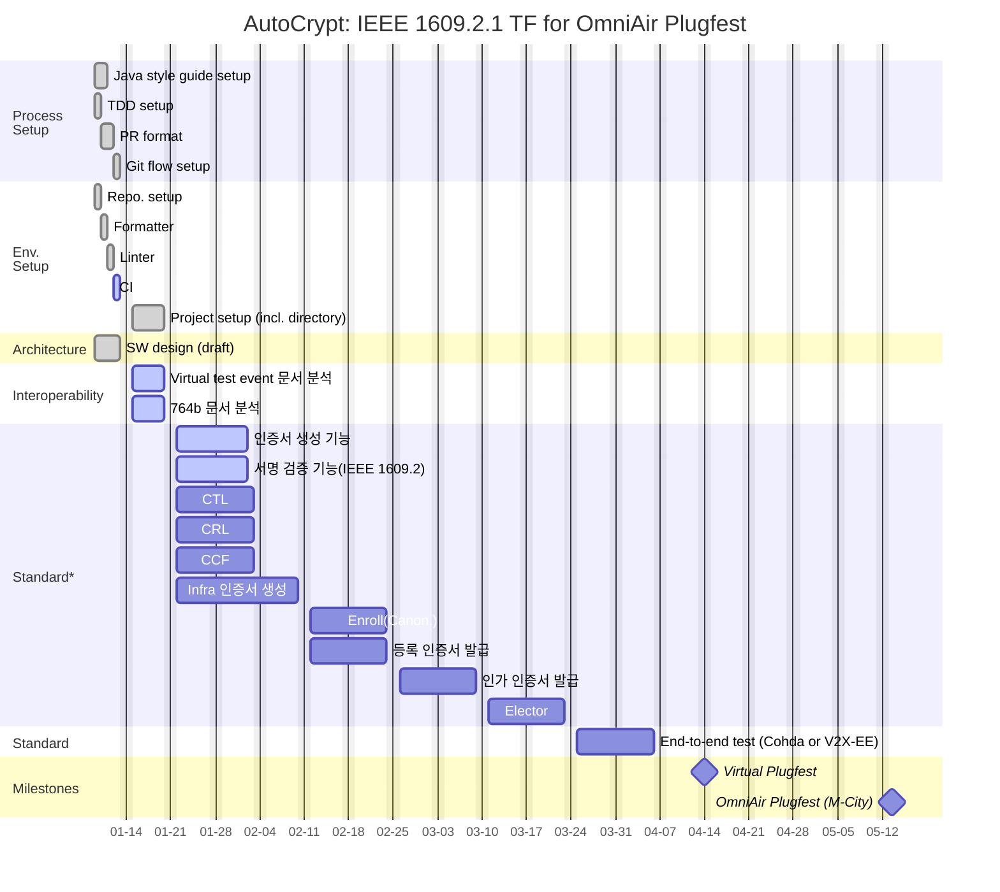

<!-- .slide: template="[[tpl-title]]" -->
::: title
IEEE 1609.2.1 TF 킥오프 워크샵<!-- element style="color: black" -->
:::

::: author
자동차보안연구소 (이진우, 이유빈, 배호성, 김유성, 김영빈, 유민근, 이형석, 이선함)
:::

::: date
📆 2024-01-08 09:00 ~ 18:00 서울창업허브 공덕, 본관 세미나실 8
:::

---

## 📢 공덕 서울창업허브 사용 관련 안내

- ==사용 당일, 1층 고객지원실 방문(필수)하여 문의하시기 바랍니다 (대관 및 장비 사용 관련 안내)==
- 시설 사용 후 모든 사용 장비는 원상복구 부탁드리며,  ==발생한 쓰레기는 본관 1층 별도의 공간에 모아주시기 바랍니다==.
- 대관료는 기본적으로 무료이나, 행사 성격에 따라 발생할 수 있으며 발생 시 주관 조직에서 비용 처리 해주시기 바랍니다.

- 시설물 설치 및 변경(현수막, 안내물, 가설물 등), 물품 및 음식 반입등의 사항이 있을 시 계획서를 작성하여 첨부하시기 바랍니다.
- 기타 회의실 사용 관련 문의는 서울창업허브 공덕(02-2115-2078)로 문의하시기 바랍니다.

::: footnotes
시설이 허용할 경우 점심으로 피자 주문
:::

---

## 목차
- 🎯 목적
- ⏰ 일정표
- 🇰‍🇷 국가 자율협력주행 인증관리체계 정보시스템 구축사업 소개
- 📚 V2X-PKI 제품 전반 / CAMP & IEEE 1609.2.1
- 🥅 IEEE 1609.2.1 TF의 목표 정의
- 💬 토의:
	- IEEE 1609.2.1 제품 설계 방안
	- 개인별 R&R
	- 개발 프로세스
- ❓ 질의응답

---

## 🎯 목적
- 대한민국 V2X-PKI 사업에 대한 소개 및 인식 공유
- IEEE 1609.2.1 TF 업무 정의:
	- 목표
	- 제품 설계 방안
	- 제품 개발 방안
	- 개인별 R&R
	- 개발 프로세스 정립

---

## ⏰ 일정표

| 시간            | 담당자 | 내용                                                                 |
| --------------- | ------ | -------------------------------------------------------------------- |
| 09:00 ~ 10:00   | 그룹장 | 국가 자율협력주행 인증관리체계 정보시스템 구축사업 소개              |
| *10:00 ~ 10:10* | -      | 😴 휴식시간                                                          |
| 10:10 ~ 11:00   | 그룹장 | V2X-PKI 제품 전반 및 IEEE 1609.2.1 소개 & IEEE 1609.2.1 TF 목표 정의 |
| *11:00 ~ 12:00* | -      | 🍖 점심시간                                                          |
| 12:00 ~ 13:00   | 전원   | IEEE 1609.2.1 개발 세부 목표, 일정 및 역할에 대한 토의               |
| *13:00 ~ 13:10* | -      | 😴 휴식시간                                                          |
| 13:10 ~ 14:00   | 전원   | IEEE 1609.2.1 제품 설계 방안에 대한 토의                             |
| *14:00 ~ 14:10* | -      | 😴 휴식시간                                                          |
| 14:10 ~ 15:00   | 전원   | 개인별 R&R 논의                                                      |
| *15:00 ~ 15:10* | -      | 😴 휴식시간                                                          |
| 15:10 ~ 16:00   | 전원   | 개발 프로세스 정립을 위한 토의                                       |
| *16:00 ~ 16:10* | -      | 😴 휴식시간                                                          |
| 16:10 ~ 18:00   | 전원   | 토의 내용 정리, 기술적 질의응답                                      |
| *18:00 ~*       | -      | 🍖 회식(소장님 참석시)                                               |
<!-- element style="min-width: 100%; background-color: #D6EEEE; font-size: 15pt" -->

::: footnotes
- 오전에 IEEE 1609.2.1 개발의 필요성 및 기술적 사항을 간략히 소개할 예정입니다
- 오후에 TF 전원과 개발 관련한 세부 사항에 대해 컨센서스를 맞출 예정입니다.
:::

---

## 목차
- 🎯 목적
- ⏰ 일정표
- <big>**🇰‍🇷 국가 자율협력주행 인증관리체계 정보시스템 구축사업 소개**</big>
- 📚 V2X-PKI 제품 전반 / CAMP & IEEE 1609.2.1
- 🥅 IEEE 1609.2.1 TF의 목표 정의
- 💬 토의:
	- IEEE 1609.2.1 제품 설계 방안
	- 개인별 R&R
	- 개발 프로세스
- ❓ 질의응답

---

## 🇰‍🇷 국가 자율협력주행 인증관리체계 정보시스템 구축사업 <small>(1/3)</small>
- 사업목적
	- 자율협력주행 시 교통상황ㆍ안전 정보, 차량위치ㆍ상태 정보 등이 실시간 공유되는 V2X 통신의 해킹 방지를 위한 국가 보안체계인 국가 자율협력주행 인증관리체계 정보시스템 구축을 통해 ’27년 완전자율주행 세계 첫 상용화 목표 달성
	- 국가 자율협력주행 인증관리체계 정보시스템 구축을 통해 외부자의 해킹, 자율협력주행 인프라의 비인가 원격조작, 잘못된 정보전송, 개인정보 침해 등의 보안 위협 예방 및 차단
	- 자율협력주행 환경에서 노변 기기와 자동차 통신 메시지에 대하여 신뢰성ㆍ익명성을 보장하는 안전한 운행기반 마련
- 사업규모
	- 사업기간: 2024 ~ 2031년
	- 총사업비: 2,787억원(전액 국비)
	- 추진방향: 국가 자율협력주행 인증관리체계 정보시스템 구축
	- 사업예정부지: 경상북도 김천시

---

## 🇰‍🇷 국가 자율협력주행 인증관리체계 정보시스템 구축사업 <small>(2/3)</small>

- 사업추진 근거 및 경위
	- 추진근거
		- ­｢자율주행자동차법｣ 제4장(’21.07) ­
		- 미래자동차 확산 및 시장선점 전략 과제 선정(’20.10, 관계부처합동) 
		- ­21년 한국판 뉴딜 추진계획 포함(’21.01) ­
		- ｢예산지원방식 개선 8대 과제｣ 점검 결과 ’27년 완전자율주행 세계 첫 상용화 목표 달성을 위해 C-ITS 인프라 조성을 집중 지원(’21.06, 기획재정부 제5회 재정운용전략위원회)
	- 사전절차 추진내용
		- V2X 인증관리체계 정보화전략계획 수립(2018년) ­
		- V2X 인증관리체계 실증사업 추진계획 수립(2019년) 
		- V2X 보안인증체계 실증시스템 운영 및 검증(2019~2020년) ­
		- 한국판뉴딜 SOC 디지털화 과제로 선정(2020년) 
		- ­｢자율주행자동차 상용화 촉진 및 지원에 관한 법률｣ 개정(2021년)

::: footnotes
[국가표준: V2X 보안 인증관리체계와 인증서 관리 인터페이스](https://atcrypt.sharepoint.com/:b:/s/AutoCrypt/EVCv8cw8CDRPlB0dR6DklvQB6l61Cdldx4I_wngDfoQcNQ?e=reMbtw)
:::

---

## 🇰‍🇷 국가 자율협력주행 인증관리체계 정보시스템 구축사업 <small>(3/3)</small>

- 참고자료
	-  [TS(한국교통안전공단) - 국가 자율협력주행 인증관리체계 정보시스템 구축 BPR ISP 수립](https://atcrypt.sharepoint.com/sites/AutoCrypt/Shared%20Documents/Automotive%20Trends/_by%20AUTOCRYPT%20%5B%EB%B3%B4%EC%95%88%20%EC%A4%80%EC%88%98%5D/Seminar%20and%20Lecture%20-%20External%20%5B%EC%99%B8%EB%B6%80%20%EB%B0%9C%ED%91%9C%5D/2021/20211108%20(%EA%B3%BC%EA%B8%B0%EB%B6%80)%20ICT%EB%94%94%EB%B0%94%EC%9D%B4%EC%8A%A4%ED%8C%80/%EC%B0%B8%EC%A1%B06_%EA%B5%AD%EA%B0%80%20%EC%9E%90%EC%9C%A8%ED%98%91%EB%A0%A5%EC%A3%BC%ED%96%89%20%EC%9D%B8%EC%A6%9D%EA%B4%80%EB%A6%AC%EC%B2%B4%EA%B3%84%20%EC%A0%95%EB%B3%B4%EC%8B%9C%EC%8A%A4%ED%85%9C%20%EA%B5%AC%EC%B6%95%20BPR%20ISP%20%EC%88%98%EB%A6%BD.pdf "https://atcrypt.sharepoint.com/sites/AutoCrypt/Shared%20Documents/Automotive%20Trends/_by%20AUTOCRYPT%20%5B%EB%B3%B4%EC%95%88%20%EC%A4%80%EC%88%98%5D/Seminar%20and%20Lecture%20-%20External%20%5B%EC%99%B8%EB%B6%80%20%EB%B0%9C%ED%91%9C%5D/2021/20211108%20(%EA%B3%BC%EA%B8%B0%EB%B6%80)%20ICT%EB%94%94%EB%B0%94%EC%9D%B4%EC%8A%A4%ED%8C%80/%EC%B0%B8%EC%A1%B06_%EA%B5%AD%EA%B0%80%20%EC%9E%90%EC%9C%A8%ED%98%91%EB%A0%A5%EC%A3%BC%ED%96%89%20%EC%9D%B8%EC%A6%9D%EA%B4%80%EB%A6%AC%EC%B2%B4%EA%B3%84%20%EC%A0%95%EB%B3%B4%EC%8B%9C%EC%8A%A4%ED%85%9C%20%EA%B5%AC%EC%B6%95%20BPR%20ISP%20%EC%88%98%EB%A6%BD.pdf")
	- [KETI - V2X 통신 국내외 기술 및 추진 현황](https://atcrypt.sharepoint.com/:b:/s/AutoCrypt/EY-1p51PqTRDiihpWASS4fMBqjqPGg4B4qohGvrfpDarpA?e=ZDDPZX)

---

## 목차
- 🎯 목적
- ⏰ 일정표
- 🇰‍🇷 국가 자율협력주행 인증관리체계 정보시스템 구축사업 소개
- <big>**📚 V2X-PKI 제품 전반 / CAMP & IEEE 1609.2.1**</big>
- 🥅 IEEE 1609.2.1 TF의 목표 정의
- 💬 토의:
	- IEEE 1609.2.1 제품 설계 방안
	- 개인별 R&R
	- 개발 프로세스
- ❓ 질의응답

---

## 📚 V2X-PKI 제품 전반 / CAMP & IEEE 1609.2.1
- 하기 자료 참고:
	- [CarSecurity-20221011_1609_2_1](https://atcrypt.sharepoint.com/:p:/s/AutoCrypt/EQItpJsKOxlCm3n0EGtgrwMBiC5fHuJ-wyUK0GqrUgayFQ?e=QmjhT5)
	- [신규 입사자 V2X 보안 교육 자료](https://auto-jira.atlassian.net/wiki/spaces/V2X2/pages/1024098544/V2X)

::: footnotes
TF구성원이 최소한도의 지식은 가질 수 있도록 참고 자료 중심으로 설명
:::

---

## 목차
- 🎯 목적
- ⏰ 일정표
- 🇰‍🇷 국가 자율협력주행 인증관리체계 정보시스템 구축사업 소개
- 📚 V2X-PKI 제품 전반 / CAMP & IEEE 1609.2.1
- <big>**🥅 IEEE 1609.2.1 TF의 목표 정의**</big>
- 💬 토의:
	- IEEE 1609.2.1 제품 설계 방안
	- 개인별 R&R
	- 개발 프로세스
- ❓ 질의응답

---

## 🥅 IEEE 1609.2.1 TF의 목표 정의<small>(1/2)</small>

- 예타(국가 자율협력주행 인증관리체계 정보시스템 구축) 탈락으로 인해, 국가 시스템 구축은 최소한 3년은 미뤄질 것으로 예상됨(2027년 예상)
	- 국가 단위를 커버할 수 있는 시스템은 2027년까지만 갖추면 충분함
	- 전국의 2천만대 자동차를 감당할 수 있어야 함
- 국가 시스템 구축이 3년 뒤에 진행된다 하더라도, 국내 CAMP(도공)의 후계 시스템은 납품할 수 있어야 하며, 2024년 내에 제공해야 할 것으로 예상됨
	- 본사업때까지 CAMP와 IEEE 1609.2.1 시스템이 병행 운영될 것으로 예상됨
	- CAMP 시스템의 사례를 보았을 때, 총 1~10만대정도의 단말을 감당할 수 있는 시스템이면 됨
- IEEE 1609.2.1 기능 완전성을 인정받기 위해 옴니에어 상호호환성 테스트를 통과해야 함
	- 2024년 5월 13-17일, 미시건
	- 2024년 4월 13부터 Virtual Plugfest(원격 상호호환성 테스트) 대응이 가능해야 함

::: footnotes
'[[2024-01-02 IEEE 1609.2.1 TF 운영 계획서]]' 참고
:::

---

## 🥅 IEEE 1609.2.1 TF의 목표 정의<small>(2/2)</small>

- 📅 2024-04-13: 
	- Level-I(Interoperability): 
		- 옴니에어 대응 버전
	- 대만 테스트 참가사
		- 서버: ISS, Blackberry, CHT, AtoS, Microsec, ==SaesolTech==
		- 단말: Commsignia, SaesolTech, Unex, Spirent
- 📅 2024-08-31: 
	- Level-D(Demonstration System):
		- 도공 CAMP 대응 버전(옵션: 운영(관리, 통계 등) 페이지 포함)
- 📅 2026-12-31: 
	- Level-P(Production System):
		- 국가 인증관리체계 대응 버전

***TF 기간 내에 어느 Level까지 염두에 두고 개발을 진행할 것인가?***

---

## 기능 요구사항
- Level-I, D, P 공통:
	- **설계 및 구현 상세**:
		- IEEE 1609.2-2022
		- IEEE 1609.2.1-2022
		- https://www.scmsmanager.org/publications/
	- **검수**:
		- 필수: 
			- [[V2X 상호호환성 테스트 문서 일람#764b-OA-TSS&TP-160921|764b-OA-TSS&TP-160921]] 최신판 시나리오로 검증
		- 참고: 
			- IEEE 1609.2.1-2022 PICS 확인
- Level-D, P:
	- 운영, 관리, 통계 등: [도로교통공사 실증사업 요구사항정의서 등](https://atcrypt.sharepoint.com/:f:/s/AutoCrypt/EjXQvj7s3TtDsIjPZEqPNr8BepaFqE1gXPKAstxhVc1p5w?e=OJoyzB)
	- [전략사업부 - IEEE 1609.2.1 실증 적용시 고려사항](https://atcrypt.sharepoint.com/:p:/s/AutoCrypt/EXYMC0AhiztOm6YQb_nFHYsBBLyA-Wg0TBZAzO5vtB70FQ?e=Da12X7) 
	- ISO 9000, 9001, ==27001(마르콰르트)==
		- *9001, 27001 인증은 이미 획득함*

---

## 비기능 요구사항(Level-P 기준)
$f(year) = (\sum_{i=1}^{year-1}(4million \times 52 \times 20)) + (4million \times 156 \times 20)$

- 연간 400만대 자동차가 생산된다 가정함
- 최종 목표값
	- 인증서 3,000억장/년
		- SCMS 논문 참고
	- 초당 10,000장 발급하고 내려보내야 함
		- (도공 CAMP버전이 1,000장/s - **확인 필요**)
	- 연간 인증서 90 테라바이트 저장 필요
- 서버 안정성:
	- 99.9% 가용성 목표
	- 다중화 지원 필요(최저 active-passive)
- 보안
	- WebTrust때 사용했던 정도의 보안 H/W 필요? 루트 운영?

==Level-I, D와 Level-P 간 요구사항 차이가 극명함==

---

## 목차
- 🎯 목적
- ⏰ 일정표
- 🇰‍🇷 국가 자율협력주행 인증관리체계 정보시스템 구축사업 소개
- 📚 V2X-PKI 제품 전반 / CAMP & IEEE 1609.2.1
- 🥅 IEEE 1609.2.1 TF의 목표 정의
- <big>💬 **토의:**</big>
	- <big>**IEEE 1609.2.1 제품 설계 방안**</big>
	- <big>**개인별 R&R**</big>
	- <big>**개발 프로세스**</big>
- ❓ 질의응답

---

## IEEE 1609.2.1 제품 설계 방안<small>(1/2)</small>
- 목표(제품의 방향성 및 우선순위)
	- 총 10만대 OBU를 감당할 수 있는 SCMS 제작
	- 가용성: 비 스트레스 상황에서 죽지 않도록 하기
	- 옵션 기능 지원:
		- 구현
			- Canonical 구현
			- Elector 구현(상호호환성 테스트에서 생략할 수 있다면 후순위로 구현(도공에 필요))
			- 플러그테스트 지원 항목 결정(절반 이상을 목표로)
		- 비구현
			- MBR등 표준화 되지 않은 옵션 고려 안함
			- 인증서 발행 주기는 CAMP 동일향만 고려
			- BKE는 Original만 고려
			- ACPC 무시 🚫 
			- OAuth2 무시 🚫 
			- 프론트엔드: 상호호환성 테스트 시점까지는 최저한으로 개발

---
## IEEE 1609.2.1 제품 설계 방안<small>(2/2)</small>
- 큰 아키텍처
	- 프로젝트 구조, 폴더 구조, 모듈화
- 아티팩트(배포물) 형태

- 코드 재사용
	- ERD(재사용 x 🚫): 도공에 내보내기 전까지는 유연하게 재구현하되, 도공에 내보내는 시점에는 하드닝하기
	- ASN en/decoder 🆗 
- 기관분리: Y 🆗
- 타 국가향 고려(YD/T, ETSI v2.2.1): N(북미향만 고려해서 개발) 🚫 
- Crypto: 라이브러리 형식으로 사용

---

## WBS

<!-- element style="width: 100%; min-width: 100%;" -->

---

## IEEE 1609.2.1 TF 2024-Q1 OKR
- 🎯 Objective
	- 옴니에어 상호호환성 테스트향 IEEE 1609.2.1 개발(절반 이상 통과)
- 🧮 Key Results
	- (필수) 0.0 CTL, CRL, CCF, 인프라 인증서 생성
		- CTL, CRL 생성: 0.3
		- CCF 생성: 0.3
		- 인프라 인증서 생성: 0.4
	- 0.0 IEEE 1609.2.1 제품화 레벨의 프로세스 적용
		- PR, 코드 리뷰, CI, TDD 프로세스 내재화: 0.3
		- 정적 분석기, 포매터 적용: 0.3
		- CD 적용: 0.4
	- 0.0 Original BKE를 통한 AC 발급 성공
		- Original BKE 구현: 0.3
		- 옴니에어 테스트 케이스 중 Original BKE 항목 전부 지원: 0.3
		- Cohda 혹은 V2X-EE를 통한 인증서 발급 전과정 테스트 성공: 0.4

---

## 개인별 R&R
- TF장:
	- 김영빈
- TF원
	- 멘토: 이유빈, 배호성, 유민근
	- 멘티: 김유성, 이선함, 이형석

::: footnotes
직급생략
:::

---

## 예상되는 위험요소 및 선제적 대응방안
- 서버 안정성: 
	- V2X-EE 제품 혹은 Cohda 제품을 사용하여 정기적으로 종단 테스트 수행
- Mahindra 과제 대응: 
	- 필요시 Mahindra 과제에 인력 지원
- 1월 말까지 프로젝트 셋업 후 WBS 재확인

---

## 관리 프로세스<small>(1/2)</small>
- 스크럼 사용

- 이벤트
	- **계획회의**
		- 백로그 그루밍
			- TF장이 주도(작성)
			- 리뷰회의에서 비중을 올리거나 → 별도 회의 잡기
	- **데일리**
		- 10분
		- 시간: 10시
		- 번다운 차트 확인: Y
	- **리뷰회의**
		- 작게라도 데모 진행
		- 격주간 보고서 작성
	- **회고회의**
		- 일반적으로 진행

---

## 관리 프로세스<small>(2/2)</small>
- 아티팩트
	- 유저스토리: 3W
	- 인수테스트: TDD 수행
- 기타
	- 설계회의: Y
		- 프로젝트 설계 관련 논의
		- 개선사항에 대한 시연
		- 안건이 없으면 세미나/질의응답
	- 코드리뷰(팀 단위): Y
	- 페어프로그래밍: 계획회의때 인당 1페어 지정 가능
	- 페르소나: 안함

---

## 개발 프로세스 및 도구<small>(1/5)</small>
![[IEEE 1609.2.1 TF - 개발 프로세스 참고용.png]]

- 린터, 포매터 도입
- CI/CD 도입

---

## 개발 프로세스 및 도구<small>(2/5)</small>
- Bitbucket
	- 코드리뷰 도구(구매)
- 브랜치 전략:
	- main / feature / hotfix 3분류
- 릴리즈: 태깅으로 버전 표시
	- 버저닝: semver
- 정적 분석기: SonarQube
- 스타일 가이드:  https://google.github.io/styleguide/javaguide.html 를 기조로 커스텀

---

## 개발 프로세스 및 도구<small>(3/5)</small>

---

## 개발 프로세스 및 도구<small>(4/5)</small>
- PR 형식
	- 코드 리뷰어 선정: 스프린트 회의시 선정
	- 설명(디스크립션)
		- 주요 변경사항 요약
		- 리뷰어에서 검토받고 싶은 내용 강조
	- 주요 PR 내용
		- TDD용 테스트 작성
		- 인터페이스 등 스켈레톤 작성
		- 실제 구현 완료(main 머지 가능)
	- 코멘트/대응
		- 코멘트가 달린 경우 회신은 꼭 할 것
		- 코드 라인 코멘트가 아니더라도 전체 코멘트 회신은 할 것
	- 승인: **PR Approve 버튼 클릭**
	- 수정요청: "**수정 요청:**" prefix 달기
	- 조언: 꼭 받아들이지 않아도 됨
		- 권고사항이 아닌 경우 "**팁:**", "**조언:**" 등의 prefix 달기
	- 리뷰어 추가: "**더블체크 요청: @name**"

---

## 개발 프로세스 및 도구<small>(5/5)</small>
- Commit 메시지 규정:
	- If applied, this commit will (                     )
	- 적용되었을 때 이 커밋은 (                   )
		- 괄호 안에 들어갈 수 있는 문구로 넣기
	- 기타 세부 규정: https://auto-jira.atlassian.net/wiki/spaces/V2X2/pages/733906344/Git
- CI/CD
	- 팀시티 or 젠킨스
		- 목표: 작은 테스트(필수), 큰 테스트(End-to-end Test) 가능한지 여부 추가 확인
- TDD
	- 실전 박치기

---

## 목차
- 목적
- 일정표
- 국가 자율협력주행 인증관리체계 정보시스템 구축사업 소개
- V2X-PKI 제품 전반 / CAMP & IEEE 1609.2.1
- IEEE 1609.2.1 TF의 목표 정의
- 토의:
	- IEEE 1609.2.1 제품 설계 방안
	- 개인별 R&R
	- 개발 프로세스
- <big>**질의응답**</big>

---

## ❓ 질의응답