## 관리자 - 서버 초기 설정
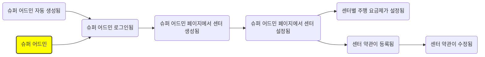

## 관리자 - 일반 관리자 초기 설정
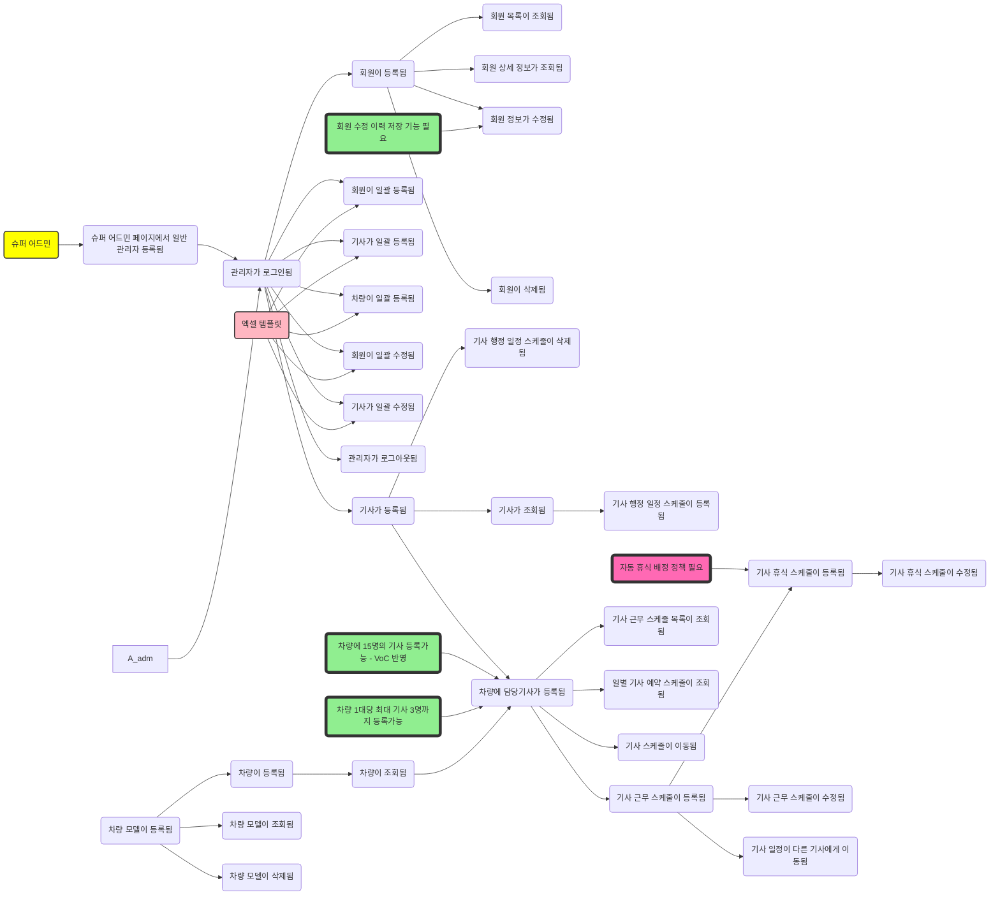

## 관리자 - 일상 운영
```mermaid
flowchart LR
    %% --- 유형 정의 ---
    classDef actor      fill:#ffff00,stroke:#333,stroke-width:2px
    classDef command     fill:#add8e6,stroke:#333,stroke-width:2px
    classDef system      fill:#ffb6c1,stroke:#333,stroke-width:2px
    classDef hotspot     fill:#ff69b4,stroke:#333,stroke-width:6px
    classDef opportunity fill:#90ee90,stroke:#333,stroke-width:6px
    classDef policy      fill:#e6e6fa,stroke:#333,stroke-width:2px
    classDef readmodel   fill:#8fbc8f,stroke:#333,stroke-width:2px

    A_suadm(슈퍼 어드민):::actor
    %% A_ctradm(센터 관리자):::actor
    A_adm(일반 관리자):::actor
    A_user(회원):::actor
    %% A_driver(기사):::actor
	
	S_map(지도 서비스):::system
	S_firebase(Firebase):::system
	S_ncp(문자발송 서버):::system
	S_safenum(안심번호 발급 서버):::system
	
	Ec1_a1(유선으로 예약이 요청됨)
	Ec1_a2(예약이 접수됨)
	Oc1_a2(상습 무단 취소 승객으로 블랙리스트 표시 기능 필요):::opportunity
	Ec1_a3(출발지에게 경유지, 목적지까지의 주행거리가 계산됨)
	Ec1_a4(승객의 예약의 중복여부가 확인됨)
	Ec1_a5(예약이 등록됨)
	Ec1_b1(배송이 요청됨)
	Ec1_b2(배송이 접수됨)
	Hc1_b2(예약과 동시간대에 중복하여 접수 가능):::hotspot
	Ec1_c1(취소된 예약 내역이 조회됨)
	Ec1_c2(취소된 예약이 복구요청 됨)
	Ec1_d1(예약 내역이 조회됨)

	A_user --> Ec1_a1
	A_user --> Ec1_b1
	A_adm --> Ec1_c1
	A_adm --> Ec1_d1
	A_adm --> Ec1_a2
	Oc1_a2 --> Ec1_a2
	A_adm --> Ec1_b2
	Hc1_b2 --> Ec1_b2
	Ec1_a1 --> Ec1_a2 --> Ec1_a3 --> S_map
	Ec1_b1 --> Ec1_b2 --> Ec1_a3 --> Ec1_a4 --> Ec1_a5
	Ec1_c1 --> Ec1_c2 --> Ec1_a3
	
	Ec1_a5_a1(접수 기록에 예약 내역이 생성됨)
	Ec1_a5_b1(배차대기 상태로 전환됨)
	Ec1_a5_c1(다량의 예약이 등록됨)
	Ec1_a5_c2(전체 기사, 즉 차량의 배차 일정이 확인됨)
	Ec1_a5_c3(다량의 예약이 일괄 배차됨)
	Oc1_a5_c3(일괄배차의 예약취소와 예약변경 문자 송신 기능 필요):::opportunity
	Hc1_a5_c1(16시쯤 전화가 몰림, 배차대기로 일괄 예약접수 후 자동 혹은 수동배차로 진행):::hotspot
	
	Ec1_a5 --> Ec1_a5_a1
	Ec1_a5 --> Ec1_a5_b1
	Ec1_a5 --> Ec1_a5_c1
	A_adm --> Ec1_a5_c1
	Hc1_a5_c1 --> Ec1_a5_c1 --> Ec1_a5_c2 --> Ec1_a5_c3
	A_adm --> Ec1_a5_c2
	A_adm --> Ec1_a5_c3
	Oc1_a5_c3 --> Ec1_a5_c3 --> Ec1_a5_b1_a2
	
	Ec1_a5_b1_a1(자동배차됨)
	Hc1_a5_b1_a1(자동배차됨):::hotspot
	Hc1_a5_b1_a1 --> Ec1_a5_b1_a1
	Ec1_a5_b1_a2(예약 완료 상태 전환됨)
	Ec1_a5_b1_b1(예약이 수동배차됨)
	A_adm --> Ec1_a5_b1_b1
	Ec1_a5_b1_c1(예약이 자동배차 실패됨)
	Ec1_a5_b1_c2(자동배차가 실패 후 수동배차 가능 시간이 출력됨)
	
	Ec1_a5_b1 --> Ec1_a5_b1_a1 --> Ec1_a5_b1_a2
	Ec1_a5_b1 --> Ec1_a5_b1_b1 --> Ec1_a5_b1_a2
	Ec1_a5_b1 --> Ec1_a5_b1_c1 --> Ec1_a5_b1_c2 --> Ec1_a5_b1_b1
	A_adm --> Ec1_a5_b1_b1
	
	Ec1_a5_b1_a2_a1(당일예약의 경우, 배차 내역이 기사앱에 푸시로 발송됨)
	Ec1_a5_b1_a2_a1 --> S_firebase
	Ec1_a5_b1_a2_b1(예약 내역이 문자로 승객에게 발송됨)
	Ec1_a5_b1_a2_b1 --> S_ncp
	Ec1_a5_b1_a2_c1(모든 탑승자에게 안심번호 할당됨)
	Ec1_a5_b1_a2_c1 --> S_safenum
	Hc1_a5_b1_a2_c1(안심번호 할당 정책 필요):::hotspot
	Hc1_a5_b1_a2_c1 --> S_safenum
	Ec1_a5_b1_a2_d1(예약정보만 변경됨)
	Ec1_a5_b1_a2_e1(예약 변경 요청됨)
	A_user --> Ec1_a5_b1_a2_e1
	Ec1_a5_b1_a2_f1(예약이 취소 요청됨)
	A_user --> Ec1_a5_b1_a2_f1
	
	Ec1_a5_b1_a2 --> Ec1_a5_b1_a2_a1
	Ec1_a5_b1_a2 --> Ec1_a5_b1_a2_b1
	Ec1_a5_b1_a2 --> Ec1_a5_b1_a2_c1
	Ec1_a5_b1_a2 --> Ec1_a5_b1_a2_d1
	Ec1_a5_b1_a2 --> Ec1_a5_b1_a2_e1
	Ec1_a5_b1_a2 --> Ec1_a5_b1_a2_f1
	
	Ec1_a5_b1_a2_e2(배차가 취소됨)
	Ec1_a5_b1_a2_e1 --> Ec1_a5_b1_a2_e2
	A_adm --> Ec1_a5_b1_a2_e2
	Oc1_a5_b1_a2_e2(예약 수정 이력 저장 기능 필요):::opportunity
	Oc1_a5_b1_a2_e2 --> Ec1_a5_b1_a2_e2
	
	Ec1_a5_b1_a2_e2_a1(예약이 변경됨)
	Ec1_a5_b1_a2_e2_b1(업무일지에 예약내역이 갱신됨)
	Ec1_a5_b1_a2_e2_c1(접수기록에 예약내역이 갱신됨)
	
	Ec1_a5_b1_a2_e2 --> Ec1_a5_b1_a2_e2_a1
	Ec1_a5_b1_a2_e2 --> Ec1_a5_b1_a2_e2_b1
	Ec1_a5_b1_a2_e2 --> Ec1_a5_b1_a2_e2_c1
	
	Ec1_a5_b1_a2_f2(배차가 취소됨)
	Ec1_a5_b1_a2_f1 --> Ec1_a5_b1_a2_f2
	A_adm --> Ec1_a5_b1_a2_f2
	Ec1_a5_b1_a2_f2 --> Ec1_a5_b1_a2_e2_b1
	Ec1_a5_b1_a2_f2 --> Ec1_a5_b1_a2_e2_c1
	
	Ec1_a5_b1_a2_e2_a1_a1(배차대기 상태로 전환됨)
	Ec1_a5_b1_a2_e2_a1_b1(기사앱으로 예약변경 푸시 발송됨)
	Ec1_a5_b1_a2_e2_a1_b2(예약변경 푸시 발송이 확인됨)
	Ec1_a5_b1_a2_e2_a1_c1(승객에게 예약변경 문자 발송됨)
	Ec1_a5_b1_a2_e2_a1_c2(예약변경 문자 발송 확인됨)
	
	Ec1_a5_b1_a2_e2_a1 --> Ec1_a5_b1_a2_e2_a1_a1
	Ec1_a5_b1_a2_e2_a1 --> Ec1_a5_b1_a2_e2_a1_b1 --> Ec1_a5_b1_a2_e2_a1_b2
	Ec1_a5_b1_a2_e2_a1_b1 --> S_firebase
	Ec1_a5_b1_a2_e2_a1 --> Ec1_a5_b1_a2_e2_a1_c1 --> Ec1_a5_b1_a2_e2_a1_c2
	Ec1_a5_b1_a2_e2_a1_c1 --> S_ncp
	
	Ec1_a5_b1_a2_f3(예약이 무단 혹은 정상 취소됨)
	Ec1_a5_b1_a2_f2 --> Ec1_a5_b1_a2_f3
	
	Ec1_a5_b1_a2_f3_a1(승객에게 예약취소 문자 발송됨)
	Ec1_a5_b1_a2_f3_a2(예약취소 문자 발송 확인됨)
	Oc1_a5_b1_a2_f3_a2(문자 발송에 대한 성공/실패에 대한 내역을 관리자에서 확인 가능하면 좋겠음):::opportunity
	Hc1_a5_b1_a2_f3_a2(문자 발송에 대한 클레임이 많음):::hotspot
	Ec1_a5_b1_a2_f3_b1(기사앱으로 예약취소 푸시 발송됨)
	Ec1_a5_b1_a2_f3_b2(예약취소 푸시 발송이 확인됨)
	Ec1_a5_b1_a2_f3_c1(예약자의 무단 취소 횟수가 증가됨)
	Oc1_a5_b1_a2_f3_c1(무단취소에 대한 블랙리스트 관리가 있으면 좋겠음):::opportunity
	Hc1_a5_b1_a2_f3_c1(무단은 승객에 의한 취소, 정상은 그 외):::hotspot
	
	Ec1_a5_b1_a2_f3 --> Ec1_a5_b1_a2_f3_a1 --> S_ncp
	Ec1_a5_b1_a2_f3_a1 --> Ec1_a5_b1_a2_f3_a2
	Oc1_a5_b1_a2_f3_a2 --> Ec1_a5_b1_a2_f3_a2
	Hc1_a5_b1_a2_f3_a2 --> Ec1_a5_b1_a2_f3_a2
	Ec1_a5_b1_a2_f3 --> Ec1_a5_b1_a2_f3_b1 --> Ec1_a5_b1_a2_f3_b2
	Ec1_a5_b1_a2_f3_b1 --> S_firebase
	Ec1_a5_b1_a2_f3 --> Ec1_a5_b1_a2_f3_c1
	
	Oc1_a5_b1_a2_f3_c1 --> Ec1_a5_b1_a2_f3_c1
	Hc1_a5_b1_a2_f3_c1 --> Ec1_a5_b1_a2_f3_c1
```

## 관리자 - 기사 연계
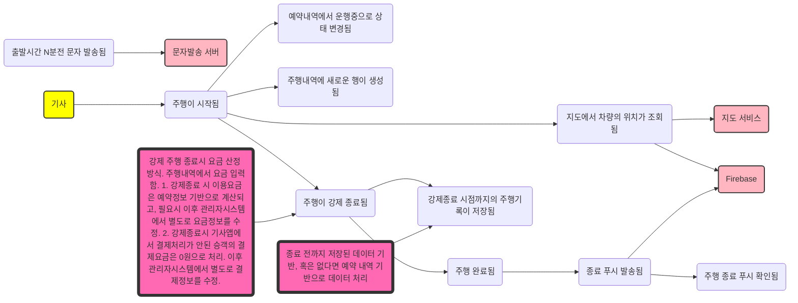

## 관리자 - 주행 종료 처리
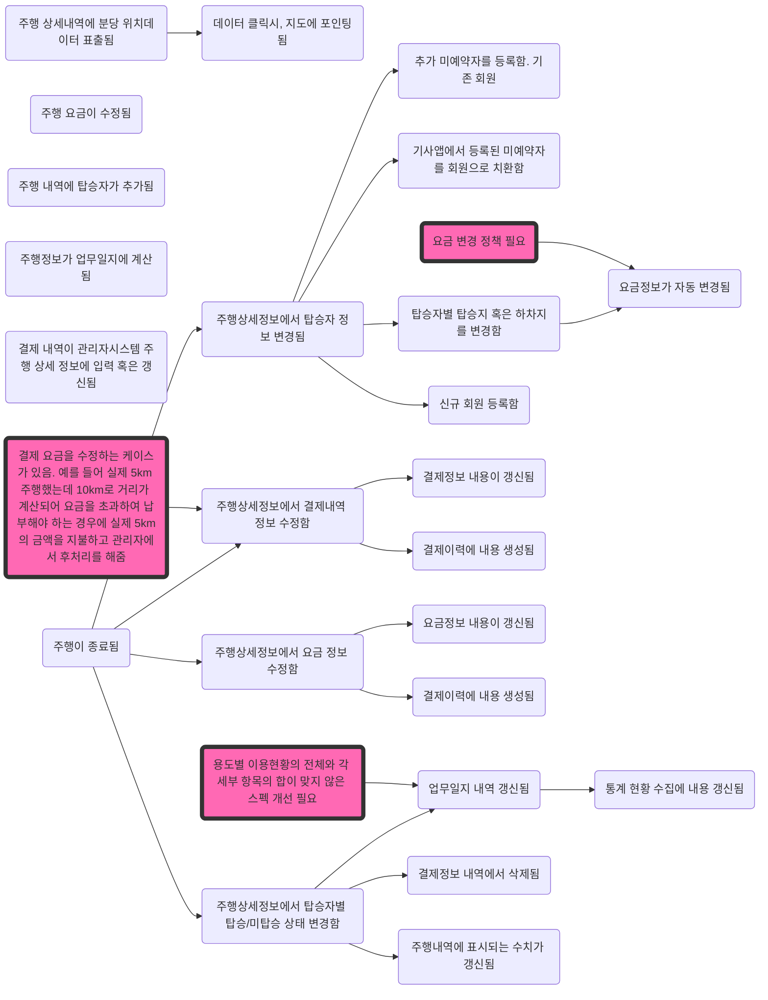

## 관리자 - 기타
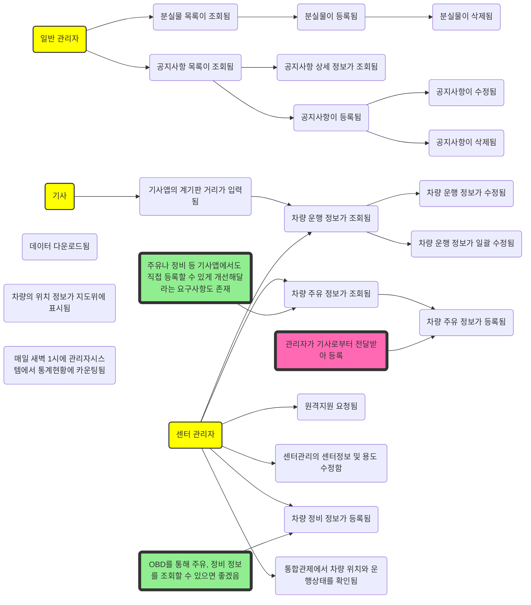

---
## 기사앱 - 초기 설정
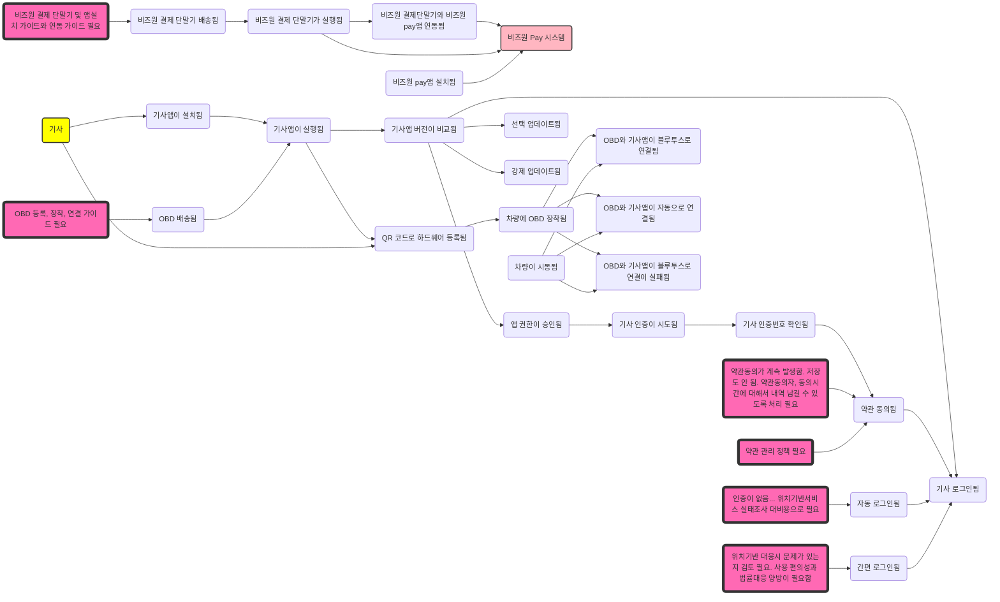

## 기사앱 - 일반 기능
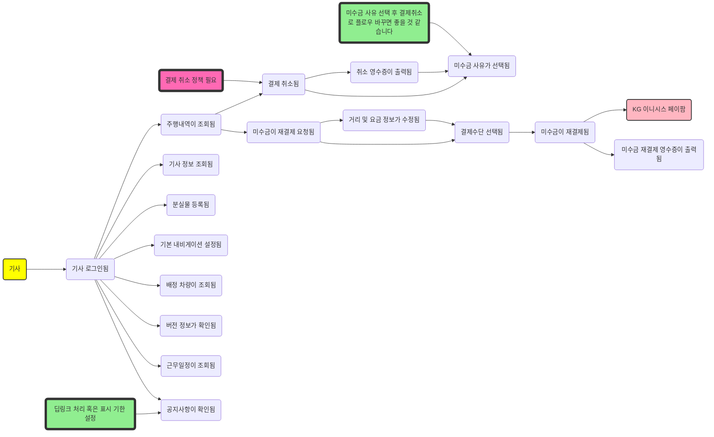

## 기사앱 - 배차 조회
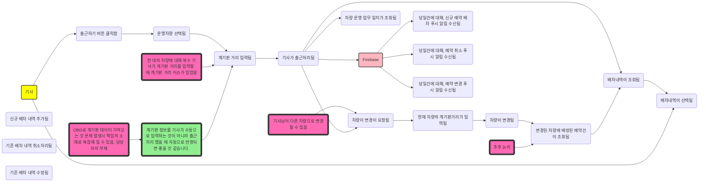

## 기사앱 - 배차 선택과 주행
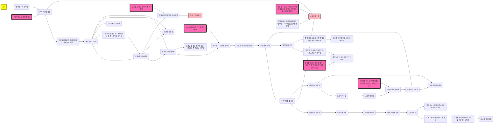

## 기사앱 - 요금 결제
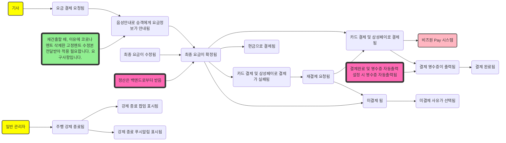

## 기사앱 - 기타
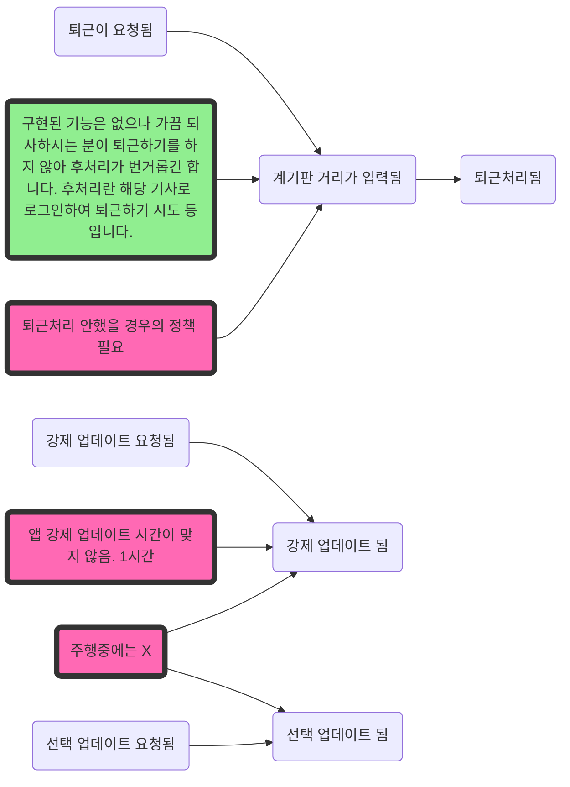

## 기사앱 - 배송
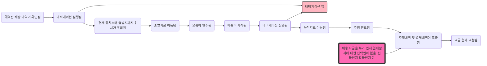

