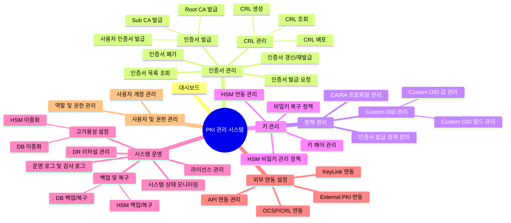

## 💡 **정보 구조 설계 (IA) 가이드**

- **어떤 단계인가?** 서비스가 제공할 정보의 전체 구조와 메뉴 체계를 설계합니다. 웹사이트의 '사이트맵'처럼, 어떤 메뉴가 있고 각 메뉴는 어떤 하위 메뉴로 구성되는지 계층 구조로 표현합니다.
- **왜 작성해야 하는가?** 사용자가 원하는 정보를 쉽고 빠르게 찾을 수 있도록 서비스의 뼈대를 잡는 과정입니다.

---

### **A. 텍스트 기반 구조 (빠른 작성용)**

들여쓰기를 이용해 간단하고 빠르게 전체 구조를 파악할 수 있습니다.

```
PKI 관리 시스템
    대시보드
    인증서 관리
        인증서 발급 요청
        인증서 발급
            Root CA 발급
            Sub CA 발급
            사용자 인증서 발급
        인증서 목록 조회
        인증서 갱신/재발급
        인증서 폐기
        CRL 관리
            CRL 생성
            CRL 배포
            CRL 조회
    정책 관리
        인증서 발급 정책 정의
        CA/RA 프로파일 관리
        Custom OID 관리
            Custom OID 필드 관리
            Custom OID 값 관리
    키 관리
        HSM 연동 관리
        키 페어 관리
        비밀키 복구 정책
        HSM 비밀키 관리 정책
    시스템 운영
        시스템 상태 모니터링
        운영 로그 및 감사 로그
        백업 및 복구
            DB 백업/복구
            HSM 백업/복구
        고가용성 설정
            DB 이중화
            HSM 이중화
        DR 리허설 관리
        라이선스 관리
    외부 연동 설정
        KeyLink 연동
        External PKI 연동
        OCSP/CRL 연동
        API 연동 관리
    사용자 및 권한 관리
        사용자 계정 관리
        역할 및 권한 관리
```

---

### **B. 다이어그램 기반 구조 (시각화용)**

Mermaid를 사용하여 메뉴 구조를 시각적인 다이어그램으로 표현합니다.


