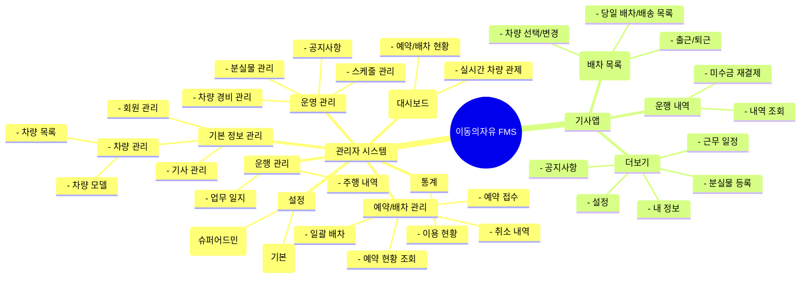

## 💡 **정보 구조 설계 (IA) 가이드**

- **어떤 단계인가?** 서비스가 제공할 정보의 전체 구조와 메뉴 체계를 설계합니다. 웹사이트의 '사이트맵'처럼, 어떤 메뉴가 있고 각 메뉴는 어떤 하위 메뉴로 구성되는지 계층 구조로 표현합니다.
- **왜 작성해야 하는가?** 사용자가 원하는 정보를 쉽고 빠르게 찾을 수 있도록 서비스의 뼈대를 잡는 과정입니다.

---

### **A. 텍스트 기반 구조 (빠른 작성용)**

들여쓰기를 이용해 간단하고 빠르게 전체 구조를 파악할 수 있습니다.

```
1. 관리자 시스템
    1.1. 통합 관제 (대시보드)
        - 실시간 차량 위치 및 상태 모니터링
        - 예약/배차 현황
    1.2. 예약/배차 관리
        - 예약 접수
        - 예약 현황 조회 (배차대기, 배차완료 등)
        - 일괄 배차
        - 취소된 예약 조회 및 복구
    1.3. 운행 관리
        - 주행 내역 조회
        - 업무 일지
    1.4. 기본 정보 관리
        - 회원 관리 (등록, 조회, 수정, 삭제)
        - 기사 관리 (등록, 조회, 수정, 삭제)
        - 차량 관리
            - 차량 목록
            - 차량 모델
    1.5. 운영 관리
        - 스케줄 관리 (기사 근무/휴식/행정 일정)
        - 공지사항 관리
        - 분실물 관리
        - 차량 경비 관리 (주유, 정비)
    1.6. 통계
        - 용도별/기간별 이용 현황
    1.7. 설정
        - 센터 정보 관리 (센터 관리자)
        - 요금제 관리 (센터 관리자)
        - 약관 관리 (센터 관리자)
        - 관리자 계정 관리 (슈퍼 어드민)
        - 센터 생성/관리 (슈퍼 어드민)

2. 기사앱
    2.1. 홈 (배차 목록)
        - 출근/퇴근 처리
        - 운행 차량 선택/변경
        - 계기판 거리 입력
        - 당일 배차/배송 목록 조회
    2.2. 운행 내역
        - 날짜별 주행/배송 내역 조회
        - 미수금 재결제
        - 결제 취소
    2.3. 더보기
        - 내 정보 조회
        - 근무 일정 확인
        - 공지사항 확인
        - 분실물 등록
        - 설정
            - 기본 내비게이션 설정
            - 버전 정보 확인
            - 로그아웃
```

---

### **B. 다이어그램 기반 구조 (시각화용)**

Mermaid를 사용하여 메뉴 구조를 시각적인 다이어그램으로 표현합니다.


