## 💡 **프로세스 표현 가이드**

- 프로세스를 가장 잘 설명할 수 있는 방식을 사용하여 작성합니다. (Flowchart, BPMN, Sequence Diagram, Use Case 등)
- 다이어그램만으로 설명이 부족할 경우, 각 단계의 세부 내용이나 비즈니스 규칙을 보충 설명합니다.

---

### **프로세스 개요**

| 항목 | 설명 |
| :--- | :--- |
| **목적** | Root CA, Sub CA, 사용자 인증서를 포함한 다양한 유형의 인증서 발급 요청부터 최종 발급 완료까지의 전체 라이프사이클을 관리하고 자동화하여, 안전하고 효율적인 인증서 제공을 목표로 합니다. |
| **시작 조건** | - 인증서 발급을 위한 정책 및 프로파일이 정의되고 등록됨.   - Root CA, Sub CA 발급을 위한 상위 인증서 체인이 구성됨.   - ADMIN User, 인증서 발급 요청자 또는 외부 연계 시스템으로부터 인증서 발급 요청이 접수됨. |
| **종료 조건** | - 요청된 ROOT CA, Sub CA, 사용자 및 서버 인증서가 성공적으로 발급되고 HSM에 안전하게 키가 저장됨.   - 발급된 인증서가 요청자에게 전달되거나 시스템에 적용됨. |

---

### **프로세스 표현 (Flowchart)**

```mermaid
graph TD
    subgraph Prerequisites
        A[정책 관리자] --> R16(CA/RA 프로파일 생성됨)
        A --> R1(CP/CPS가 작성됨)
        A --> R2(주요 인증서 발급 정책 정의)
        A10[외부 연계 시스템] --> R27(인증서 프로파일 등록/수정됨)
        S2[External PKI] --> R13(기존 CA Chain Import됨)
        R13 --> R11(CA 인증서용 키를 저장함)
        A5[ADMIN User] --> R9(Sub CA 인증서 발급할 상위 인증서 체인이 구성됨)
        P3(EKU 발급 필드 정의 등 정책) -- 영향 --> R16
    end

    subgraph Certificate Issuance Request
        U1(인증서 발급 요청자) --> R17(인증서 발급 요청됨)
        A5 --> R14(ROOT 인증서 발급 요청됨)
        A10 --> R28(CA 인증서 발급 요청됨)
        A10 --> R30(사용자 인증서 발급 요청이 들어옴)
        R17 -- 수정 요청 --> O4(발급 요청 이후 수정 기능 필요)
    end

    subgraph Certificate Issuance Processing
        R14 & R11 --> R10(ROOT 인증서 발급됨)
        R9 --> R15(Sub CA 인증서 발급됨)
        R17 --> R18(인증서 발급 처리 요청이 들어옴)
        R18 --> R36(인증서 발급 정책이 확인됨)
        R36 --> S1[HSM]
        R10 & R15 & R19 --> S1
        R28 --> S3[KeyLink]
        S1 -- 실패 시 --> H7(자동 발급 실패 처리)
        R19 -- 확장 필드 추가 --> O3(발급 프로파일에 없는 필드 추가 가능)
        R19 -- TLS 직접 발급 --> H8(TLS Server/Client 직접 발급?)
        H8 -- 개선 필요 --> H9(TLS 내부 관리 개선)
        H9 -- 제안 --> O10(DB에 통합 관리 제안)
    end

    subgraph Certificate Issuance Completion
        R10 --> C1(ROOT 인증서 발급 완료)
        R15 --> C2(Sub CA 인증서 발급 완료)
        R19 --> C3(사용자 인증서 발급 완료)
        S1 --> C1 & C2 & C3
        C1 --> R12(서버 인증서 발급됨)
        C2 --> A6[인증서 발급 요청자]
        C3 --> A6
        R40(CA 인증서가 발급됨) -- 발급 완료 --> A7[인증서 관리자]
    end

    U1[인증서 발급 요청자]:::actor
    A[정책 관리자]:::actor
    A5[ADMIN User]:::actor
    A6[인증서 발급 요청자]:::actor
    A7[인증서 관리자]:::actor
    A10[외부 연계 시스템]:::actor
    S1[HSM]:::system
    S2[External PKI]:::system
    S3[KeyLink]:::system
    R1(CP/CPS가 작성됨):::readmodel
    R2(주요 인증서 발급 정책 정의):::readmodel
    R9(Sub CA 인증서 발급할 상위 인증서 체인이 구성됨):::readmodel
    R10(ROOT 인증서 발급됨):::readmodel
    R11(CA 인증서용 키를 저장함):::readmodel
    R12(서버 인증서 발급됨):::readmodel
    R13(기존 CA Chain Import됨):::readmodel
    R14(ROOT 인증서 발급 요청됨):::readmodel
    R15(Sub CA 인증서 발급됨):::readmodel
    R16(CA/RA 프로파일이 생성됨):::readmodel
    R17(인증서 발급 요청됨):::readmodel
    R18(인증서 발급 처리 요청이 들어옴):::readmodel
    R19(인증서 발급 완료됨):::readmodel
    R27(인증서 프로파일 등록/수정됨):::readmodel
    R28(CA 인증서 발급 요청됨):::readmodel
    R30(사용자 인증서 발급 요청이 들어옴):::readmodel
    R36(인증서 발급 정책이 확인됨):::readmodel
    R40(CA 인증서가 발급됨):::readmodel
    P3(EKU 발급 필드 정의 등 정책):::policy
    O3(발급 프로파일에 없는 필드 추가 가능):::opportunity
    O4(발급 요청 이후 수정 기능 필요):::opportunity
    O10(DB에 통합 관리 제안):::opportunity
    H7(자동 발급 실패 처리):::hotspot
    H8(TLS Server/Client 직접 발급?):::hotspot
    H9(TLS 내부 관리 개선):::hotspot
```

---

### **상세 절차**

| 단계 | 수행자 | 행동 (Action) | 상세 설명 |
| :--- | :--- | :--- | :--- |
| **1단계** | 정책 관리자, 외부 연계 시스템 | **정책 및 프로파일 정의** | 인증서 발급을 위한 기본적인 정책(CP/CPS, EKU 정의 등)과 CA/RA 프로파일, 인증서 프로파일을 시스템에 정의하고 등록합니다. 이는 모든 인증서 발급의 기반이 됩니다. (R1, R2, P3, R16, R27) |
| **2단계** | ADMIN User, 시스템 | **상위 인증서 체인 및 키 준비** | 외부 PKI 시스템으로부터 기존 CA 체인을 임포트하고, HSM(Hardware Security Module)을 통해 CA 인증서용 키를 안전하게 저장합니다. Sub CA 발급을 위한 상위 인증서 체인을 구성하여 발급 준비를 완료합니다. (S2, R13, R11, A5, R9, S1) |
| **3단계** | ADMIN User, 인증서 발급 요청자, 외부 연계 시스템 | **인증서 발급 요청 제출** | ADMIN User는 ROOT CA 발급을 요청하거나, 일반 인증서 발급 요청자는 사용자 인증서를 요청합니다. 외부 연계 시스템을 통해서도 CA 인증서 또는 사용자 인증서 발급 요청이 접수될 수 있습니다. 발급 요청 이후에도 내용을 수정할 수 있는 기능이 제공되어야 합니다. (R14, R17, R28, R30, O4) |
| **4단계** | 시스템, HSM, KeyLink | **인증서 발급 처리** | 시스템은 접수된 요청에 대해 정의된 인증서 발급 정책(R36)을 확인하고, HSM을 통해 안전하게 키를 생성하고 서명하여 인증서를 생성합니다. 외부 CA 인증서 발급의 경우 KeyLink(S3)와 같은 외부 시스템을 연동하여 처리될 수 있습니다. 자동 발급 중 실패 발생 시 처리 방안(H7)에 대한 고려가 필요합니다. |
| **5단계** | 시스템, HSM | **인증서 발급 완료 및 저장** | 요청된 ROOT CA(R10), Sub CA(R15), 사용자(R19) 및 서버(R12) 인증서가 성공적으로 발급 완료됩니다. 발급된 모든 인증서의 비밀키는 HSM(S1)에 안전하게 저장됩니다. 인증서 발급 프로파일에 없는 확장 필드 추가 기능(O3)이 지원되어야 하며, TLS 서버/클라이언트 인증서 직접 발급(H8) 및 내부 관리 방식 개선(H9, O10)이 고려됩니다. 발급된 CA 인증서(R40)는 인증서 관리자에게 전달됩니다. |
