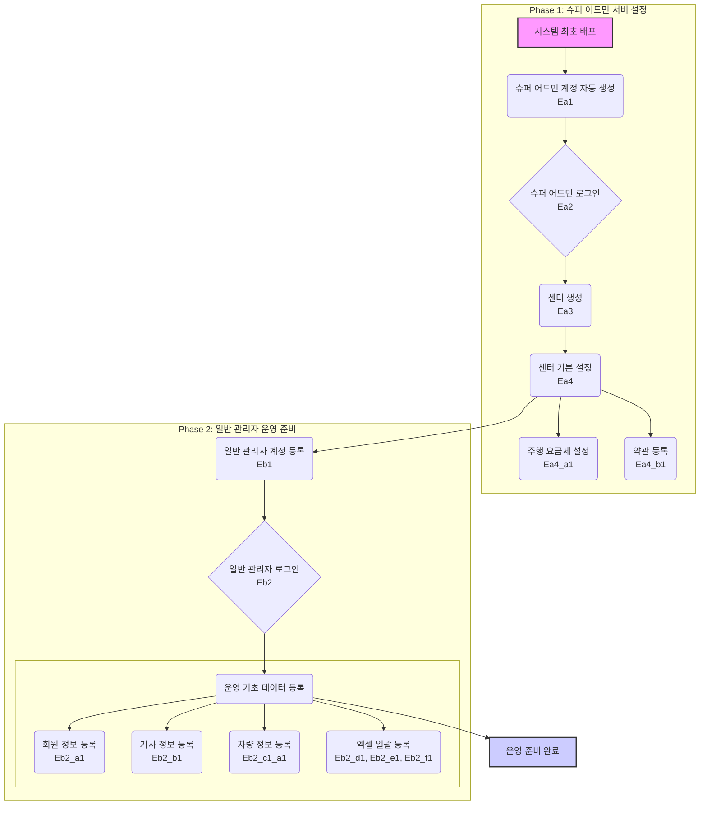

## 💡 **프로세스 표현 가이드**

- 프로세스를 가장 잘 설명할 수 있는 방식을 사용하여 작성합니다. (Flowchart, BPMN, Sequence Diagram, Use Case, User Journey 등)
- BPMN의 경우 UML만 허용되며, 나머지는 Mermaid로 작성해야 합니다.
- 다이어그램만으로 설명이 부족할 경우, 각 단계의 세부 내용이나 비즈니스 규칙을 보충 설명합니다.

---

### **프로세스 개요**

| 항목 | 설명 |
| :--- | :--- |
| **목적** | 슈퍼어드민이 신규 센터를 생성하고 운영에 필요한 기본 설정을 완료한 후, 일반 관리자를 등록하여 서비스 운영에 필요한 기초 데이터(회원, 기사, 차량 등)를 입력하는 전체 과정입니다. |
| **시작 조건** | 시스템이 최초로 배포되어 슈퍼 어드민 계정이 자동 생성된 상태입니다. |
| **종료 조건** | 센터 및 일반 관리자 계정 생성이 완료되고, 운영에 필요한 기초 데이터(회원, 기사, 차량 등)가 시스템에 등록되어 예약 접수 및 배차를 시작할 수 있는 상태가 됩니다. |

---

### **프로세스 표현 (Flowchart)**

---

### **상세 절차**

| 단계 | 수행자 | 행동 (Action) | 상세 설명 |
| :--- | :--- | :--- | :--- |
| 1 | 슈퍼 어드민 | 센터 생성 및 설정 | 시스템 배포 후, 슈퍼 어드민이 로그인하여 신규 센터를 생성하고, 해당 센터의 운영 정책(요금제, 약관 등)을 설정합니다. |
| 2 | 슈퍼 어드민 | 일반 관리자 등록 | 생성된 센터를 관리할 일반 관리자 계정을 등록합니다. |
| 3 | 일반 관리자 | 로그인 및 기초 데이터 준비 | 등록된 계정으로 로그인하여, 운영에 필요한 기초 데이터를 등록할 준비를 합니다. (엑셀 템플릿 다운로드 등) |
| 4 | 일반 관리자 | 회원 정보 등록 | 개별 회원 정보를 등록하거나, 엑셀 템플릿을 사용하여 다수의 회원 정보를 일괄 등록합니다. |
| 5 | 일반 관리자 | 기사 정보 등록 | 소속 기사 정보를 개별 또는 일괄로 등록합니다. 차량에 담당 기사를 배정하는 작업을 포함합니다. |
| 6 | 일반 관리자 | 차량 정보 등록 | 운영할 차량의 모델 및 상세 정보를 개별 또는 일괄로 등록합니다. |
| 7 | 일반 관리자 | 스케줄 등록 | 기사들의 근무, 휴식, 행정 등 초기 스케줄을 등록하여 배차가 가능한 상태로 만듭니다. |
