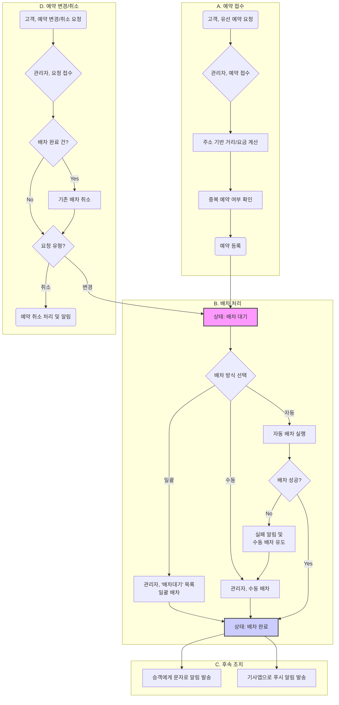

## 💡 **프로세스 표현 가이드**

- 프로세스를 가장 잘 설명할 수 있는 방식을 사용하여 작성합니다. (Flowchart, BPMN, Sequence Diagram, Use Case, User Journey 등)
- BPMN의 경우 UML만 허용되며, 나머지는 Mermaid로 작성해야 합니다.
- 다이어그램만으로 설명이 부족할 경우, 각 단계의 세부 내용이나 비즈니스 규칙을 보충 설명합니다.

---

### **프로세스 개요**

| 항목 | 설명 |
| :--- | :--- |
| **목적** | 고객(회원)의 유선 예약 요청을 관리자가 시스템에 접수하고, 자동 또는 수동으로 기사(차량)에게 배차를 완료하는 전반적인 과정을 정의합니다. |
| **시작 조건** | 고객(회원)이 콜센터를 통해 유선으로 차량 운행을 예약 요청합니다. |
| **종료 조건** | 예약 건이 기사에게 성공적으로 배차되고, 배차 완료 내역이 승객과 기사에게 통보됩니다. |

---

### **프로세스 표현 (Flowchart)**

---

### **상세 절차**

| 단계 | 수행자 | 행동 (Action) | 상세 설명 |
| :--- | :--- | :--- | :--- |
| 1 | 고객 (회원) | 예약 요청 | 고객이 콜센터(관리자)에게 전화하여 출발지, 목적지, 경유지, 희망 시간 등 예약 정보를 전달합니다. |
| 2 | 관리자 | 예약 접수 및 등록 | 관리자는 고객 정보를 조회하고(필요시 블랙리스트 여부 확인), 전달받은 예약 정보를 관리자 시스템에 입력합니다. |
| 3 | 시스템 | 정보 계산 및 확인 | 입력된 주소 정보를 기반으로 지도 서비스를 통해 주행 거리를 계산하고, 해당 고객의 시간에 중복된 예약이 있는지 확인합니다. |
| 4 | 관리자 | 예약 등록 완료 | 모든 정보가 확인되면 예약을 최종 등록합니다. 예약은 '배차대기' 상태로 전환됩니다.  - **피크 타임(16시경) 대응**: 전화가 몰릴 경우, 상세 정보 입력은 최소화하고 다수의 예약을 '배차대기' 상태로 신속하게 일괄 등록할 수 있습니다. |
| 5 | 관리자 / 시스템 | 배차 진행 | '배차대기' 상태의 예약을 기사에게 배정합니다.  - **수동 배차**: 관리자가 기사의 스케줄, 위치, 차량 상태를 직접 확인하고 특정 기사에게 예약을 배정합니다. - **자동 배차**: 시스템이 사전에 정의된 로직(거리, 운행 방향, 스케줄 등)에 따라 최적의 기사를 자동으로 찾아 배차합니다. 자동 배차 실패 시 관리자에게 알림을 보내고 수동 배차를 유도합니다. - **일괄 배차**: 관리자가 '배차대기' 목록에서 여러 예약을 선택하여 한 번에 배차를 진행합니다. |
| 6 | 시스템 | 배차 완료 및 알림 | 배차가 성공적으로 완료되면 상태가 '배차완료'로 변경됩니다.  - **기사**: 기사앱으로 배차 내역(당일 건)에 대한 푸시 알림을 발송합니다. - **승객**: 승객에게 배차된 차량 정보, 기사 연락처(안심번호) 등이 포함된 예약 확정 문자를 발송합니다. |
| 7 | 관리자 | 예약 변경/취소 처리 | 고객의 요청에 따라 기존 예약을 변경하거나 취소합니다. 이미 배차가 완료된 건의 경우, 기존 배차를 취소한 후 변경된 내용으로 다시 배차 대기 상태로 전환하거나, 기사와 승객에게 취소 알림을 발송합니다. |
