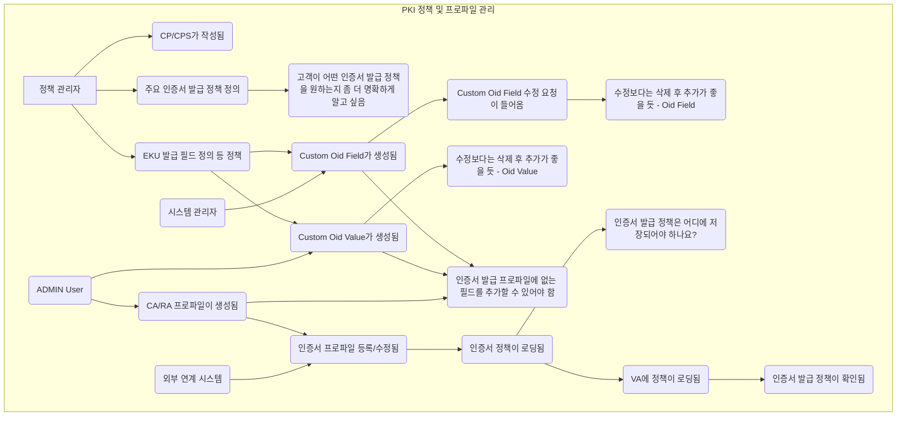

## 💡 **프로세스 표현 가이드**

- 프로세스를 가장 잘 설명할 수 있는 방식을 사용하여 작성합니다. (Flowchart, BPMN, Sequence Diagram, Use Case 등)
- 다이어그램만으로 설명이 부족할 경우, 각 단계의 세부 내용이나 비즈니스 규칙을 보충 설명합니다.

---

### **프로세스 개요**

| 항목 | 설명 |
| :--- | :--- |
| **목적** | 인증서 발급을 위한 정책(인증서 발급 정책, 프로파일, Custom OID)을 정의하고 관리하여, 일관되고 안전하며 유연한 인증서 발급 환경을 구축하고 고객의 특정 요구사항을 충족합니다. |
| **시작 조건** | CP/CPS가 작성되고, 주요 인증서 발급 정책의 초안이 정의되어 있으며, PKI 시스템이 정상적으로 운영되고 있어야 합니다. |
| **종료 조건** | PKI 시스템 내에 인증서 발급 정책, CA/RA 프로파일, Custom OID 필드 및 값이 등록/수정되어 있으며, 해당 정책들이 시스템에 성공적으로 로딩되어 인증서 발급에 활용될 준비가 완료됩니다. |

---

### **프로세스 표현 (Flowchart)**

---

### **상세 절차**

| 단계 | 수행자 | 행동 (Action) | 상세 설명 |
| :--- | :--- | :--- | :--- |
| 1 | 정책 관리자 | CP/CPS 작성 및 주요 인증서 발급 정책 정의 | 정책 관리자는 PKI 운영에 필요한 CP(Certificate Policy) 및 CPS(Certificate Practice Statement)를 작성하고, 시스템의 주요 인증서 발급 정책을 정의합니다. 이때 고객의 구체적인 요구사항을 명확히 파악하는 것이 중요합니다. (R1, R2, H2) |
| 2 | 정책 관리자, 시스템 관리자, ADMIN User | EKU(Extended Key Usage) 발급 필드 및 Custom OID 필드/값 정의 | EKU를 포함한 인증서 발급 필드 정책을 수립하고, 표준 프로파일에 없는 확장 필드가 필요할 경우 Custom OID 필드와 그 값을 정의합니다. 이는 시스템 관리자 및 ADMIN User에 의해 생성될 수 있습니다. (P3, R24, R25, H10, O3) |
| 3 | ADMIN User, 외부 연계 시스템 | CA/RA 프로파일 생성 및 수정 | 인증서 발급 시 적용될 CA(Certificate Authority) 및 RA(Registration Authority) 프로파일을 생성하고 관리합니다. 외부 시스템 연동을 통해 프로파일을 등록하거나 수정할 수도 있습니다. (R16, R27) |
| 4 | 시스템 관리자, ADMIN User | Custom OID 필드/값 수정 관리 | 생성된 Custom OID 필드 또는 값에 수정이 필요한 경우, 기존 필드를 수정하거나 (O6, O7 권고에 따라) 삭제 후 재추가하는 방식으로 관리합니다. (R26) |
| 5 | 시스템 | 정의된 정책 시스템 로딩 및 유효성 확인 | 최종 정의 및 수정된 인증서 정책(발급 정책, 프로파일, Custom OID 등)은 PKI 시스템에 로딩되어 인증서 발급 프로세스에 반영됩니다. 정책이 VA(Validation Authority)에도 로딩되고 유효성이 최종적으로 확인됩니다. 이때 정책 저장 위치에 대한 명확한 정의가 필요합니다. (R33, R34, R36, H16) |
