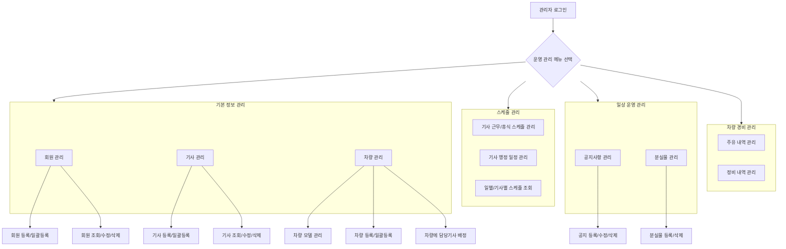

## 💡 **프로세스 표현 가이드**

- 프로세스를 가장 잘 설명할 수 있는 방식을 사용하여 작성합니다. (Flowchart, BPMN, Sequence Diagram, Use Case, User Journey 등)
- BPMN의 경우 UML만 허용되며, 나머지는 Mermaid로 작성해야 합니다.
- 다이어그램만으로 설명이 부족할 경우, 각 단계의 세부 내용이나 비즈니스 규칙을 보충 설명합니다.

---

### **프로세스 개요**

| 항목 | 설명 |
| :--- | :--- |
| **목적** | 교통 약자 이동 서비스를 원활하게 운영하기 위해 필요한 핵심 데이터(회원, 기사, 차량)를 관리하고, 스케줄, 공지, 차량 경비 등 일상적인 운영 업무를 처리하는 것을 목적으로 합니다. |
| **시작 조건** | 관리자가 관리 시스템에 로그인되어 있으며, 서비스 운영을 위한 센터 및 기본 설정이 완료된 상태입니다. |
| **종료 조건** | 회원, 기사, 차량, 스케줄 등 운영에 필요한 정보가 시스템에 등록 또는 최신화되고, 공지사항 게시나 경비 처리 등 운영 업무가 완료됩니다. |

---

### **프로세스 표현 (Flowchart)**

---

### **상세 절차**

| 단계 | 수행자 | 행동 (Action) | 상세 설명 |
| :--- | :--- | :--- | :--- |
| 1 | 일반 관리자 | **회원 정보 관리** | - 신규 회원을 개별 등록하거나, 제공된 엑셀 템플릿을 통해 일괄 등록/수정합니다. - 등록된 회원의 목록을 조회하고, 상세 정보를 확인, 수정, 삭제합니다. - **고려사항**: 회원 정보 수정 시 변경 이력을 저장하여 추적할 수 있는 기능이 필요합니다 (CRS-005). |
| 2 | 일반 관리자 | **기사 정보 관리** | - 신규 기사를 개별 등록하거나, 엑셀 템플릿을 통해 일괄 등록/수정합니다. - 등록된 기사 목록을 조회하고, 상세 정보를 확인, 수정, 삭제합니다. |
| 3 | 일반 관리자 | **차량 정보 관리** | - 운행할 차량의 모델을 등록/조회/삭제합니다. - 실제 운행 차량을 개별 또는 일괄 등록하고, 차량에 담당 기사를 배정합니다. - **고려사항**: 현장 요구(VoC)를 반영하여 차량 1대당 여러 명의 기사를 배정할 수 있어야 합니다 (CRS-007). |
| 4 | 일반 관리자 | **기사 스케줄 관리** | - 기사별 근무, 휴식, 기타 행정(교육 등) 일정을 등록하고 관리합니다. - 일별 또는 기사별로 전체 예약 및 근무 스케줄 현황을 조회하고, 필요시 스케줄을 다른 기사에게 이동시키는 등 조정합니다. - **고려사항**: 수동 관리의 번거로움을 줄이기 위해 기사 휴식 시간을 자동으로 배정하는 정책 수립이 필요합니다 (CRS-006). |
| 5 | 일반 관리자 | **공지사항 관리** | - 기사앱에 노출될 공지사항을 등록, 수정, 삭제합니다. - **고려사항**: 공지사항에 딥링크를 적용하거나 표시 기간을 설정하는 기능이 제안되었습니다 (CRS-017). |
| 6 | 일반 관리자 | **분실물 관리** | - 차량에서 발생한 분실물을 시스템에 등록하고, 목록을 조회하거나 처리 완료 후 삭제합니다. |
| 7 | 일반 관리자 | **차량 경비 관리** | - 기사로부터 전달받은 주유 및 정비 내역을 시스템에 등록하고 관리합니다. - **고려사항**: 기사가 앱에서 직접 주유/정비 내역을 등록하거나, OBD를 통해 관련 정보를 자동 조회하는 기능 개선 요구가 있습니다 (CRS-010, CRS-011). |
| 8 | 일반 관리자 | **데이터 다운로드** | - 필요시 회원, 기사, 운행 내역 등 다양한 운영 데이터를 엑셀 파일로 다운로드합니다. |
