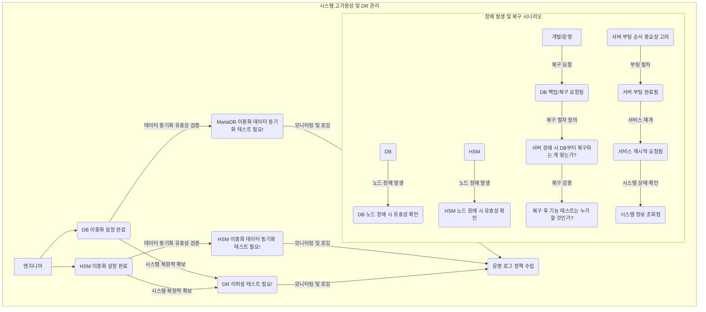

## 💡 **프로세스 표현 가이드**

- 프로세스를 가장 잘 설명할 수 있는 방식을 사용하여 작성합니다. (Flowchart, BPMN, Sequence Diagram, Use Case 등)
- 다이어그램만으로 설명이 부족할 경우, 각 단계의 세부 내용이나 비즈니스 규칙을 보충 설명합니다.

---

### **프로세스 개요**

| 항목 | 설명 |
| :--- | :--- |
| **목적** | PKI 시스템의 연속적인 서비스 가용성(High Availability)을 보장하고, 재해 발생 시 신속하고 안정적인 복구(Disaster Recovery)를 위한 관리 절차를 수립합니다. |
| **시작 조건** | PKI 시스템이 최소한의 구성으로 설치되었으며, DB 및 HSM 이중화 구성이 가능한 상태입니다. |
| **종료 조건** | PKI 시스템의 고가용성 환경이 구축 및 검증되고, 재해 복구 절차가 수립 및 테스트되어 안정적인 운영이 가능한 상태입니다. |

---

### **프로세스 표현 (Flowchart)**

---

### **상세 절차**

| 단계 | 수행자 | 행동 (Action) | 상세 설명 |
| :--- | :--- | :--- | :--- |
| 1 | 엔지니어 | DB 이중화 설정 | PKI 시스템의 핵심 데이터를 저장하는 MariaDB의 고가용성을 위해 이중화를 설정합니다. (R7) |
| 2 | 엔지니어 | HSM 이중화 설정 | 암호화 키를 안전하게 보관하는 HSM의 가용성 및 신뢰성 확보를 위해 이중화를 설정합니다. (R8) |
| 3 | 엔지니어 / QA | MariaDB 데이터 동기화 테스트 | 이중화된 MariaDB 노드 간 데이터의 실시간 동기화 및 정합성을 검증합니다. (H5) |
| 4 | 엔지니어 / QA | HSM 데이터 동기화 테스트 | 이중화된 HSM 노드 간 키 데이터의 동기화 및 접근 유효성을 검증합니다. (H6) |
| 5 | 시스템 관리자 / QA | DR 리허설 테스트 수행 | DB, HSM 이중화를 포함한 전체 DR 시스템에 대한 리허설 테스트를 정기적으로 수행하여 복구 절차와 시간을 검증합니다. (H4) |
| 6 | 정책 관리자 | 운영 로그 정책 수립 | 고가용성 및 재해 복구 상황을 대비하여 시스템의 핵심 동작 및 장애 관련 운영 로그 수집 및 보관 정책을 수립합니다. (P2) |
| 7 | 시스템 관리자 | 노드 장애 시 유효성 확인 | 이중화된 환경에서 DB 또는 HSM의 특정 노드 장애 발생 시, 시스템 전체의 유효성 및 서비스 지속성을 즉시 확인합니다. (H14) |
| 8 | 개발/운영 팀 | DB 백업 및 복구 절차 정의 | DB 백업 및 복구 요청(O11)에 따라, 서버 장애 시 DB 복구의 우선순위와 절차를 명확히 정의합니다. (H17) |
| 9 | 시스템 관리자 / QA | 복구 후 기능 테스트 책임 정의 | 시스템 복구 완료 후, 누가 어떤 범위의 기능 테스트(H18)를 수행하여 정상 작동을 검증할지 책임과 절차를 명확히 합니다. |
| 10 | 시스템 관리자 | 서버 부팅 순서 정의 | 서버 장애 복구 시, DB, HSM, PKI 서비스 등 중요 컴포넌트의 올바른 부팅 순서(H15)를 정의하여 안정적인 서비스 재개를 보장합니다. (R32) |
| 11 | 시스템 관리자 | 서비스 재시작 및 상태 확인 | 복구 완료 및 부팅 후, PKI 서비스를 재시작(R38)하고 시스템 정보 조회(R39)를 통해 정상 작동 여부 및 고가용성 상태를 최종 확인합니다. |
