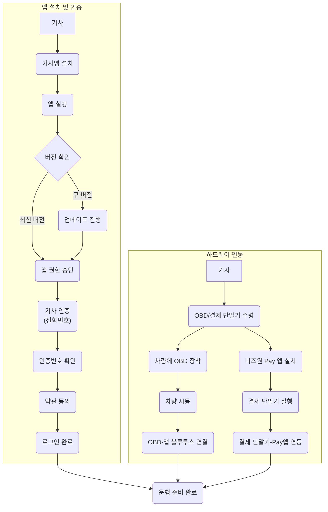

## 💡 **프로세스 표현 가이드**

- 프로세스를 가장 잘 설명할 수 있는 방식을 사용하여 작성합니다. (Flowchart, BPMN, Sequence Diagram, Use Case, User Journey 등)
- BPMN의 경우 UML만 허용되며, 나머지는 Mermaid로 작성해야 합니다.
- 다이어그램만으로 설명이 부족할 경우, 각 단계의 세부 내용이나 비즈니스 규칙을 보충 설명합니다.

---

### **프로세스 개요**

| 항목 | 설명 |
| :--- | :--- |
| **목적** | 기사가 '이동의자유' 서비스를 시작하기 위해 필요한 기사앱을 설치하고, 본인 인증 및 약관 동의를 거쳐 로그인을 완료합니다. 또한, 운행에 필수적인 OBD 단말기와 결제 단말기를 차량에 설치하고 앱과 연동하는 전체 초기 설정 과정을 정의합니다. |
| **시작 조건** | 관리자 시스템에 기사 정보가 등록되어 있고, 기사는 배송받은 OBD 및 결제 단말기를 소지하고 있습니다. |
| **종료 조건** | 기사가 앱에 성공적으로 로그인하고, OBD 및 결제 단말기 연동이 완료되어 '출근하기'를 통해 운행을 시작할 수 있는 상태가 됩니다. |

---

### **프로세스 표현 (Flowchart)**

---

### **상세 절차**

| 단계 | 수행자 | 행동 (Action) | 상세 설명 |
| :--- | :--- | :--- | :--- |
| 1 | 기사 | 앱 설치 및 실행 | 스토어에서 '이동의자유 기사앱'을 다운로드하여 설치하고 최초 실행합니다. |
| 2 | 시스템/기사 | 버전 확인 및 권한 설정 | 앱 실행 시 버전을 확인하여 필요한 경우 업데이트를 안내합니다. 이후 위치, 알림 등 서비스에 필요한 권한을 요청하고 기사가 승인합니다. |
| 3 | 기사 | 본인 인증 | 관리자 시스템에 등록된 전화번호로 본인 인증을 진행하고, 수신한 인증번호를 입력합니다. |
| 4 | 기사 | 약관 동의 | 서비스 이용약관 및 개인정보처리방침 등 필수 약관의 내용을 확인하고 동의합니다. (※ Hotspot: 약관 동의 이력(시간, 동의자) 저장 및 관리 정책 필요) |
| 5 | 시스템 | 로그인 처리 | 모든 인증 및 동의 절차가 완료되면 자동으로 로그인 처리되어 메인 화면으로 진입합니다. 간편 로그인 또는 자동 로그인 기능이 제공될 수 있습니다. |
| 6 | 기사 | OBD 단말기 설치 및 연동 | 배송받은 OBD 단말기를 차량의 OBD 포트에 장착합니다. 이후 차량 시동을 켠 상태에서 기사앱과 블루투스로 연결을 시도하고 완료합니다. (※ Hotspot: OBD 등록, 장착, 연결에 대한 명확한 가이드 필요) |
| 7 | 기사 | 결제 단말기 설정 및 연동 | 비즈원(BizOne) 결제 단말기를 준비하고, 별도의 비즈원 Pay 앱을 설치하여 결제 단말기와 연동을 완료합니다. (※ Hotspot: 결제 단말기 및 Pay앱 설치/연동 가이드 필요) |
| 8 | 시스템/기사 | 온보딩 완료 | 기사앱 로그인 및 모든 하드웨어 연동이 완료되어, '출근하기'를 통해 정상적으로 업무를 시작할 수 있는 상태가 됩니다. |
