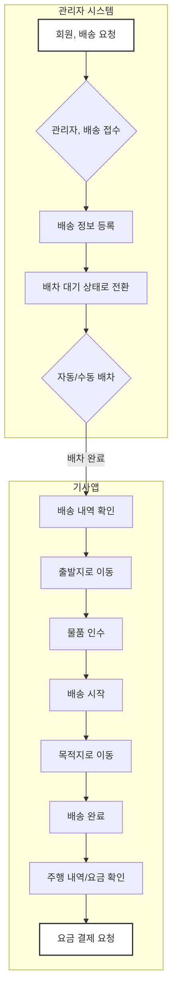

## 💡 **프로세스 표현 가이드**

- 프로세스를 가장 잘 설명할 수 있는 방식을 사용하여 작성합니다. (Flowchart, BPMN, Sequence Diagram, Use Case, User Journey 등)
- BPMN의 경우 UML만 허용되며, 나머지는 Mermaid로 작성해야 합니다.
- 다이어그램만으로 설명이 부족할 경우, 각 단계의 세부 내용이나 비즈니스 규칙을 보충 설명합니다.

---

### **프로세스 개요**

| 항목 | 설명 |
| :--- | :--- |
| **목적** | 고객이 물품 배송을 요청하면, 관리자가 이를 접수하고 기사에게 배차하여 물품을 성공적으로 목적지까지 운송하고 요금을 정산하는 전체 과정을 정의합니다. |
| **시작 조건** | 고객이 센터에 유선 등으로 물품 배송을 요청합니다. |
| **종료 조건** | 기사가 목적지에 물품 배송을 완료하고, 배송 요금 결제가 완료되거나 미수금으로 처리됩니다. |

---

### **프로세스 표현 (Flowchart)**

---

### **상세 절차**

| 단계 | 수행자 | 행동 (Action) | 상세 설명 |
| :--- | :--- | :--- | :--- |
| 1 | 회원 | 배송 요청 | 고객이 센터에 전화하여 출발지, 목적지, 물품 정보를 전달하고 배송 서비스를 요청합니다. |
| 2 | 일반 관리자 | 배송 접수 및 등록 | 관리자는 고객의 요청사항을 시스템에 입력하여 배송 건을 등록합니다. 이때 일반 예약과 동일 시간대에 중복 접수가 가능합니다. |
| 3 | 시스템/관리자 | 배송 건 배차 | 등록된 배송 건은 '배차대기' 상태가 되며, 관리자는 스케줄과 위치를 고려하여 기사에게 수동으로 배차하거나 시스템이 자동으로 배차합니다. |
| 4 | 기사 | 배차 내역 확인 | 기사는 기사앱을 통해 자신에게 배정된 배송 내역(출발지, 목적지 등)을 확인합니다. |
| 5 | 기사 | 출발지로 이동 | 기사는 내비게이션 앱을 연동하여 물품을 인수할 출발지로 이동합니다. |
| 6 | 기사 | 물품 인수 및 배송 시작 | 출발지에 도착하여 물품을 인수한 후, 기사앱에서 '배송 시작' 버튼을 눌러 주행을 시작합니다. |
| 7 | 기사 | 목적지로 이동 | 기사는 내비게이션 앱의 안내에 따라 최종 목적지로 이동합니다. |
| 8 | 기사 | 배송 완료 | 목적지에 도착하여 물품 인계를 완료한 후, 기사앱에서 '주행 완료' 버튼을 누릅니다. |
| 9 | 기사 | 요금 확인 및 결제 | 시스템에 기록된 주행 정보를 바탕으로 산정된 최종 요금을 확인하고 결제를 진행합니다. - **현안**: 현재 시스템에서는 선불, 착불 등 결제 시점이나 주체를 선택할 수 있는 기능이 없습니다. (Hn10) |
