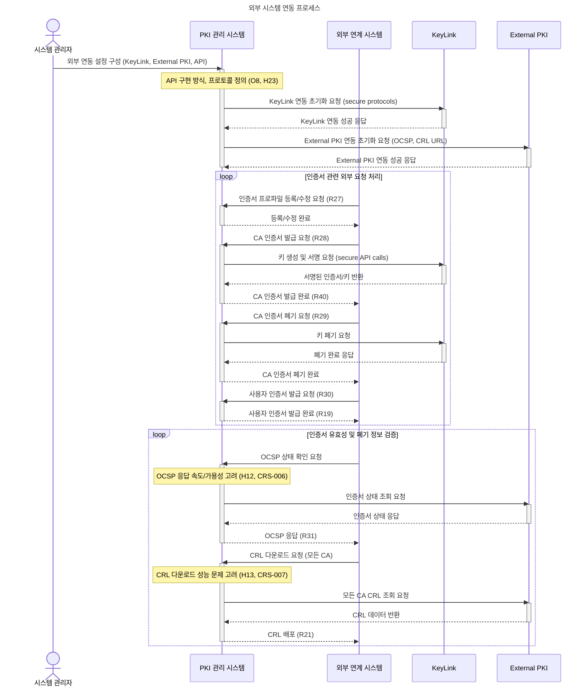

## 💡 **프로세스 표현 가이드**

- 프로세스를 가장 잘 설명할 수 있는 방식을 사용하여 작성합니다. (Flowchart, BPMN, Sequence Diagram, Use Case 등)
- 다이어그램만으로 설명이 부족할 경우, 각 단계의 세부 내용이나 비즈니스 규칙을 보충 설명합니다.

---

### **프로세스 개요**

| 항목 | 설명 |
| :--- | :--- |
| **목적** | 외부 OCSP/CRL 서비스 및 KeyLink와 같은 외부 시스템과의 안전하고 효율적인 연동을 통해 인증서 유효성 검증, 폐기 상태 관리, 그리고 암호화 키 관리 기능을 통합하고 확장합니다. 이를 통해 PKI 시스템의 신뢰성과 운영 효율성을 극대화합니다. |
| **시작 조건** | - PKI 관리 시스템이 성공적으로 설치 및 초기 설정됨.   - 외부 연동 대상 시스템(KeyLink, External PKI 등)의 네트워크 접근성 확보 및 API/프로토콜 정보가 정의됨.   - 시스템 관리자가 연동에 필요한 권한을 보유함. |
| **종료 조건** | - 외부 시스템(OCSP, CRL, KeyLink)과의 연동이 성공적으로 설정되고 정상적으로 동작함.   - 외부 시스템을 통한 인증서 상태 검증, 폐기 정보 업데이트 및 키 관리 작업이 가능함.   - OCSP 응답 속도 및 CRL 배포 성능 요구사항이 만족됨. |

---

### **프로세스 표현 (Sequence Diagram)**

---

### **상세 절차**

| 단계 | 수행자 | 행동 (Action) | 상세 설명 |
| :--- | :--- | :--- | :--- |
| 1 | 시스템 관리자 | **외부 연동 설정 구성** | PKI 관리 시스템의 외부 연동 설정 화면에서 KeyLink 연동 정보(API 엔드포인트, 인증 정보), External PKI 연동 정보(OCSP/CRL URL, 신뢰 앵커) 및 API 연동 프로토콜(예: RESTful API via URL registration)을 정의하고 등록합니다. (O8, H23) |
| 2 | PKI 관리 시스템 | **KeyLink 연동 및 암호화 작업 수행** | 설정된 KeyLink 정보를 기반으로 안전한 통신 채널을 구축합니다. CA 인증서 발급(R28) 및 폐기(R29) 요청 시, KeyLink (S3)의 API를 호출하여 키 생성, 서명, 암호화/복호화 및 키 폐기 등의 핵심 암호화 작업을 수행하고, 그 결과를 PKI 시스템에 반영합니다. (integration.txt) |
| 3 | 외부 연계 시스템 / PKI 관리 시스템 | **인증서 프로파일/발급/폐기 API 연동** | 외부 연계 시스템(A10)은 PKI 관리 시스템이 제공하는 API를 통해 인증서 프로파일 등록/수정(R27), CA 인증서 발급(R28), 사용자 인증서 발급(R30), CA 인증서 폐기(R29) 등의 요청을 전송하고, PKI 관리 시스템은 이를 처리하여 응답합니다. (CRS-015) |
| 4 | 외부 연계 시스템 / PKI 관리 시스템 | **OCSP 유효성 검증 및 응답** | 외부 연계 시스템(A10)은 인증서 유효성 검증을 위해 PKI 관리 시스템에 OCSP 상태 확인을 요청합니다. PKI 관리 시스템은 등록된 External PKI(S2) 정보 또는 자체 OCSP 응답자 역할을 통해 인증서의 폐기 상태를 확인하고, 실시간으로 OCSP 응답(R31)을 제공합니다. 이 과정에서 OCSP 응답 속도와 가용성 요구사항(H12, CRS-006)을 충족해야 합니다. |
| 5 | 외부 연계 시스템 / PKI 관리 시스템 | **CRL 배포 및 동기화** | PKI 관리 시스템은 External PKI(S2)의 CRL 저장소로부터 모든 CA의 CRL을 주기적으로 다운로드하고 최신 상태를 유지합니다. 외부 연계 시스템(A10)이 CRL 다운로드를 요청하면, PKI 관리 시스템은 최신 CRL 정보를 효율적으로 배포합니다. 이 때 모든 CA의 CRL을 다운로드하고 배포할 때 발생할 수 있는 성능 문제(H13, CRS-007)를 해결해야 합니다. |
