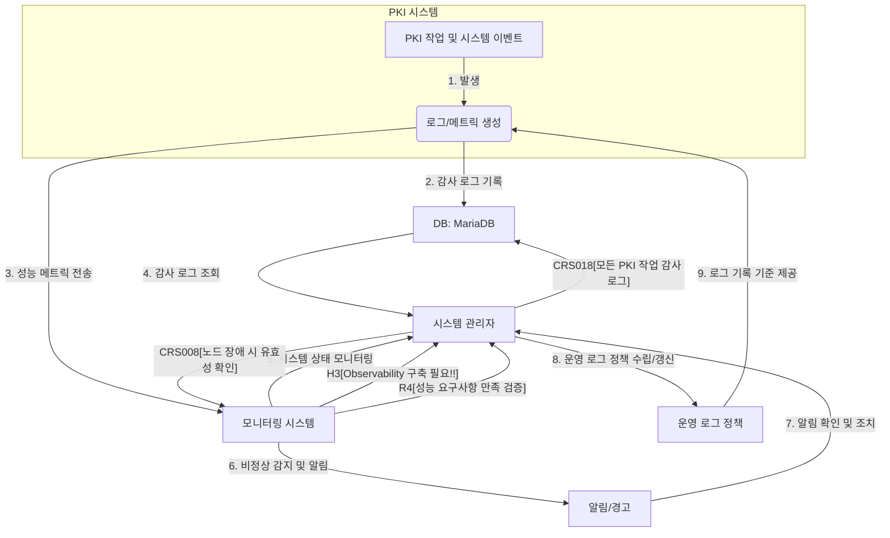

## 💡 **프로세스 표현 가이드**

- 프로세스를 가장 잘 설명할 수 있는 방식을 사용하여 작성합니다. (Flowchart, BPMN, Sequence Diagram, Use Case 등)
- 다이어그램만으로 설명이 부족할 경우, 각 단계의 세부 내용이나 비즈니스 규칙을 보충 설명합니다.

---

### **프로세스 개요**

| 항목 | 설명 |
| :--- | :--- |
| **목적** | 시스템의 안정적인 운영을 보장하고, 보안 및 규정 준수 요구사항을 충족하기 위해 PKI 시스템의 상태, 성능, 보안 이벤트 및 모든 PKI 작업 활동을 지속적으로 모니터링하고 기록합니다. 이를 통해 신속한 문제 감지 및 해결, 책임 추적성 확보를 목표로 합니다. |
| **시작 조건** | PKI 관리 시스템이 배포 및 초기 설정 완료됨.  운영 로그 정책(P2) 및 감사 로그 기록 정책이 정의됨.  모니터링 시스템과의 연동 설정 완료됨 (integration.txt 2.2).  MariaDB에 감사 로그 저장 테이블이 구성됨 (S4, integration.txt 2.1). |
| **종료 조건** | 시스템 상태 및 성능 지표가 실시간으로 모니터링되고 대시보드에서 조회 가능함.  모든 PKI 작업에 대한 상세 감사 로그가 기록 및 저장됨.  비정상 활동 또는 시스템 장애 발생 시 적절한 알림이 시스템 관리자에게 전송됨.  시스템 관리자가 로그를 조회하고 분석하여 문제 해결 및 보안 감사를 수행할 수 있음. |

---

### **프로세스 표현 (Flowchart)**

---

### **상세 절차**

| 단계 | 수행자 | 행동 (Action) | 상세 설명 |
| :--- | :--- | :--- | :--- |
| 1 | PKI 시스템 | PKI 작업 및 시스템 이벤트 발생 | 인증서 발급, 폐기, 정책 변경, 키 생성 등 모든 운영 활동과 시스템 내부의 오류, 경고 등 주요 이벤트가 발생합니다. |
| 2 | PKI 시스템 | 로그 및 메트릭 생성 | 발생한 활동 및 이벤트에 대해 상세한 감사 로그를 생성하고, 시스템의 CPU, 메모리, 네트워크, 서비스 가용성 등 성능 및 건강 상태를 나타내는 메트릭을 수집합니다. |
| 3 | PKI 시스템, DB | 감사 로그 기록 및 저장 | 생성된 감사 로그는 P2(운영 로그 정책)에 따라 MariaDB(S4)에 안전하게 저장됩니다. 이 로그는 CRS-018(모든 PKI 작업 감사 로그) 요구사항을 충족하며, 누가, 언제, 무엇을 했는지에 대한 기록을 포함합니다. |
| 4 | PKI 시스템, 모니터링 시스템 | 성능 메트릭 전송 | 수집된 성능 메트릭은 내부 또는 외부 모니터링 시스템으로 실시간 전송됩니다. 이는 integration.txt의 모니터링 시스템 연동 요구사항을 따릅니다. |
| 5 | 모니터링 시스템, 시스템 관리자 | 시스템 상태 모니터링 및 시각화 | 모니터링 시스템은 전송된 메트릭을 기반으로 PKI 시스템의 전체적인 상태 및 성능을 실시간으로 감시하고, A4(시스템 관리자)가 직관적으로 파악할 수 있도록 대시보드 형태로 정보를 시각화하여 제공합니다. 이는 H3(Observability 구축 필요!!)와 CRS-002(Observability 도구)를 지원합니다. |
| 6 | 모니터링 시스템 | 비정상 감지 및 알림 생성 | 모니터링 시스템은 미리 정의된 임계치를 초과하거나 비정상적인 패턴이 감지될 경우(예: 인증서 만료 임박, HSM(S1) 장애, 특정 노드(CRS-008) 오류) A4(시스템 관리자)에게 즉각적인 알림(SMS, 이메일, 메신저 등)을 생성하여 전송합니다. |
| 7 | 시스템 관리자 | 알림 확인 및 조치 | A4(시스템 관리자)는 수신된 알림을 확인하고, 모니터링 시스템의 대시보드와 DB(S4)에 저장된 감사 로그를 분석하여 문제의 원인을 파악하고 필요한 조치를 수행합니다. 노드 장애 시 시스템 유효성을 확인(CRS-008)하는 과정도 포함됩니다. |
| 8 | 시스템 관리자 | 감사 로그 조회 및 분석 | A4(시스템 관리자)는 필요한 경우 DB(S4)에 저장된 감사 로그를 조회하고 분석하여 보안 감사, 문제 해결, 또는 규정 준수 보고서 작성을 위한 정보를 활용합니다. |
| 9 | 시스템 관리자 | 운영 로그 정책 관리 | A4(시스템 관리자)는 P2(운영 로그 정책)를 주기적으로 검토 및 업데이트하여, 어떤 정보가 로그로 기록되어야 하는지, 로그의 보존 기간, 접근 권한 등을 정의하고 시스템에 반영하여 CRS-018(모든 PKI 작업 감사 로그)을 지속적으로 충족시킵니다. |
| 10 | QA, 시스템 관리자 | 성능 요구사항 만족 검증 | A2(QA) 및 A4(시스템 관리자)는 모니터링 데이터를 활용하여 R4(성능 요구사항 만족) 여부를 지속적으로 검증하고, 부하 테스트 결과를 모니터링 시스템을 통해 확인합니다. |
